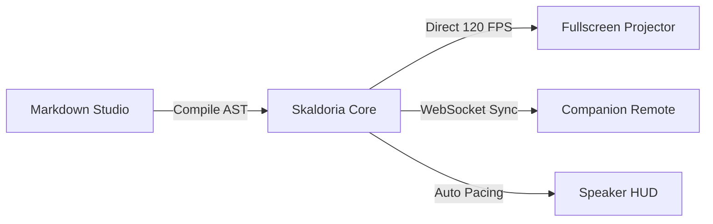

# Markdown Presentation Authoring Guide (Skaldoria Studio)

This skill provides comprehensive guidelines, syntax patterns, and best practices for authoring presentation decks using **pure standard Markdown** (without proprietary tags or heavy configuration).

---

## 1. Core Design Philosophy

When composing slides in Markdown, follow the **One Idea Per Slide** principle:
- **Scannability**: Audiences should grasp the core takeaway in under 3 seconds.
- **Visual Rhythm**: Alternate between text/bullets, side-by-side code splits, Mermaid architecture diagrams, LaTeX formulas, live audience polls, hero quotes, data tables, and big metrics.
- **Zero Proprietary Syntax**: Slides remain 100% valid, readable Markdown anywhere (GitHub, Obsidian, IDEs).

---

## 2. Slide Boundary Rule

Slides are separated strictly by standard horizontal rules:
```markdown
---
```
Always leave a blank line before and after the `---` separator.

---

## 3. Heuristic Layout Triggers & Syntax Reference

The Skaldoria layout engine inspects the structural semantics of each slide section to automatically select the optimal layout:

### A. Title / Hero Slide (`SlideLayoutType.HERO_TITLE`)
Used for opening decks, keynote intros, or section title cards.
```markdown
# Next-Gen Multiplatform Systems
### Building Resilient Native Apps with Kotlin & Compose
Engineering Tech Summit 2026

<!-- note: Welcome attendees, state the talk objectives, and outline the agenda. -->
```
- **Trigger**: Heading 1 (`# ...`) followed optionally by Subtitle (`### ...`) and presenter text.

---

### B. Bullet List Slide (`SlideLayoutType.BULLET_LIST`)
Used for feature rundowns, key takeaways, and progressive points.
```markdown
## Key Architecture Pillars

- **Zero Web Latency**: Native Skia graphics running at 120 FPS
- **Declarative Reactive State**: Single-source-of-truth StateFlow pipelines
- **Multi-Window Native Engine**: Separate projector canvas and speaker console
- **Universal Markdown AST**: Portable across any editor or repository

<!-- note: Walk through each bullet point in order. -->
```
- **Trigger**: Heading 2 (`## ...`) followed by bullet list items (`-`, `*`, `+` or `1.`, `2.`).

---

### C. Live Audience Poll Slide (`SlideLayoutType.POLL`)
Interactive polling slide that renders real-time animated percentage bars as the audience votes from their mobile phones.
```markdown
## Primary Production Database

What is your team's primary transactional database?

<!-- poll: PostgreSQL | MongoDB | CockroachDB | MySQL | Redis -->

<!-- note: Invite the audience to scan the QR code and vote live. -->
```
- **Trigger**: `<!-- poll: Opt1 | Opt2 | Opt3 -->` comment directive or `poll: Opt1 | Opt2` line.
- **Audience Voting**: Audience connects via `http://<ip>:<port>/audience` on local network to cast votes.

---

### D. Split: Text & Code Slide (`SlideLayoutType.SPLIT_TEXT_CODE`)
Side-by-side split view with descriptive text on the left and an interactive syntax-highlighted code block on the right.
```markdown
## Reactive Stream Pipeline

Here is how our pipeline parses raw Markdown events into reactive slide models:

```kotlin [1-3|5-8]
val slidesFlow = rawEventsFlow
    .filter { it.isNonEmpty }
    .map { MarkdownSlideParser.parse(it) }

fun render(slide: Slide) {
    SlideSurface(slide = slide, theme = currentTheme)
}
```

<!-- note: Highlight lines 1-3 to show the stream transformation, then step into lines 5-8. -->
```
- **Trigger**: Text or bullets accompanied by a fenced code block (` ```lang ... ``` `).
- **Line Highlighting Syntax**: Append bracketed line ranges to the language tag:
  - `[1-3|5]`: Highlights lines 1 to 3 in step 1, line 5 in step 2.
  - `[2,4,6]`: Highlights lines 2, 4, and 6.

---

### E. Mermaid Architecture & Flowchart Slide (`SlideLayoutType.DIAGRAM`)
Renders interactive, styled node-and-arrow diagrams, sequence flows, and component pipelines natively.
```markdown
## Distributed Presentation Pipeline
### Real-Time Presentation Sync Engine



<!-- note: Point out the zero-allocation pipeline between the editor and the projector. -->
```
- **Trigger**: Fenced code block with `mermaid` language tag or directive `<!-- layout: diagram -->`.
- **Supported Diagram Types**:
  - `flowchart LR` / `graph TD`: Flowcharts with node shapes `[Rectangle]`, `(Rounded)`, `{Decision}`, `((Circle))` and branch labels `-->|Yes|`.
  - `sequenceDiagram`: Actor headers, message arrows `Alice ->> Bob: Hello`, and return signals.

---

### F. LaTeX Mathematical Formula Slide (`SlideLayoutType.MATH_FORMULA`)
Renders mathematical equations with typography, stacked fractions, root symbols, Greek glyphs, and superscripts/subscripts.
```markdown
## Algorithmic Pacing Formula
### Speaker Rhythm Optimization

$$ \Delta t = t_{elapsed} - \left( \frac{T_{target}}{N_{total}} \right) \cdot i_{current} $$

- **Pacing Delta ($\Delta t$)**: Computes exact time offset relative to scheduled slide milestones
- **Target Allocation**: Automatically balances talk time across all slides in the deck

<!-- note: Explain how the pacing delta calculates drift per slide. -->
```
- **Trigger**: `$$ ... $$` math block delimiters, ` ```math ```` code fences, or directive `<!-- layout: math -->`.
- **Supported Math Syntax**:
  - Fractions: `\frac{numerator}{denominator}`
  - Roots: `\sqrt{x}` or `\sqrt[n]{x}`
  - Greek Letters: `\alpha`, `\beta`, `\gamma`, `\delta`, `\Delta`, `\Psi`, `\Omega`, `\Sigma`, `\pi`
  - Calculus & Operators: `\int`, `\sum`, `\prod`, `\lim`, `\approx`, `\neq`, `\le`, `\ge`, `\to`, `\Rightarrow`
  - Subscripts & Superscripts: `x_i`, `a_{n-1}`, `x^2`, `e^{-i\pi}`

---

### G. Data Table / Matrix Slide (`SlideLayoutType.DATA_TABLE`)
Renders comparison matrices, benchmark results, and feature grids with styled headers and zebra striping.
```markdown
## Framework Benchmark Matrix

| Metric | Web / Electron | Flutter | Skaldoria Studio |
| :--- | :--- | :--- | :--- |
| Memory Footprint | 350 MB - 600 MB | 95 MB | 45 MB - 65 MB |
| Startup Latency | 1.8s - 3.2s | 0.8s | 0.25s (Instant) |
| UI Frame Pacing | 60 FPS capped | 60-120 FPS | 120 FPS Native Skia |
| Binary Size | ~120 MB | ~40 MB | ~28 MB |

<!-- note: Emphasize the 10x memory efficiency and instant startup latency. -->
```
- **Trigger**: Standard Markdown pipe table syntax (`| Col 1 | Col 2 |`).

---

### H. Big Quote Slide (`SlideLayoutType.BIG_QUOTE`)
High-impact editorial slide for thought leadership, philosophy, or keynote reflections.
```markdown
## Guiding Philosophy

> "Simplicity is prerequisite for reliability."
> - Edsger W. Dijkstra

<!-- note: Pause for 10 seconds to allow the audience to reflect on simplicity. -->
```
- **Trigger**: Blockquote (`> Quote text`) ending with author citation (`> - Author Name`).

---

### I. Hero Metric Slide (`SlideLayoutType.BIG_METRIC`)
Stat callout displaying massive numbers, percentages, or growth metrics.
```markdown
## Performance SLA

99.99% Uptime Guarantee

<!-- note: Share our incident response drill data for the past four quarters. -->
```
- **Trigger**: Standalone metric pattern (e.g. `99.99%`, `+140%`, `$4.2M`, `50ms`) followed by a short label.

---

### J. Split: Text & Media Slide (`SlideLayoutType.SPLIT_TEXT_MEDIA`)
Side-by-side layout displaying text alongside an architecture diagram or screenshot.
```markdown
## Global Edge Network

- Distributed multi-region points of presence
- Automated anycast DNS routing
- Sub-5ms edge TLS termination


<!-- note: Point to the edge node clusters illustrated in the diagram. -->
```
- **Trigger**: Text or list items accompanied by standard Markdown image ``.

---

## 4. Speaker Notes Syntax

Notes are extracted automatically for the Presenter View and are never displayed on the projector screen:
- **HTML Comment Format**:
  ```markdown
  <!-- note: Remember to mention our Q3 roadmap here. -->
  ```
- **Markdown Quote Format**:
  ```markdown
  > note: Speak slowly and ask for audience questions.
  ```

---

## 5. Presenter Pacing Gauge & Rehearsal Optimization

Skaldoria includes an intelligent Pacing HUD to prevent running overtime:
- **Target Presets**: Set target talk duration (`5m`, `10m`, `15m`, `20m`, `30m`, `45m`, or `Off`).
- **Live Rhythm Drift**: Calculates `idealElapsedSeconds` for the active slide and shows drift offset (e.g. `+30s BEHIND PACE` or `-15s AHEAD OF PACE`).
- **Visual Status Badges**:
  - 🟢 **ON TRACK** (Emerald): Within ±15 seconds of target pace
  - 🔵 **AHEAD** (Cyan): Ahead of target schedule
  - 🟠 **BEHIND** (Amber): Over 20 seconds behind schedule
  - 🔴 **OVERTIME** (Red): Total allocated talk duration exceeded

---

## 6. Mobile Remote & Live Audience Portal

Control presentations wirelessly and interact with your audience from any device:
1. Open Presenter View (<kbd>P</kbd>) and click **Mobile Remote / Audience**.
2. **Speaker Clicker (`/remote`)**:
   - Next / Previous slide navigation
   - Live Speaker Notes reader
   - Stage Blackout (<kbd>B</kbd>) and Whiteout (<kbd>W</kbd>)
   - Live Audience Questions stream & moderation
3. **Audience Portal (`/audience`)**:
   - Live in-slide polling with instant vote recording
   - Audience Q&A question submission and community upvoting

---

## 7. Live Presenter Controls & Keybindings

| Action | Shortcut |
| :--- | :--- |
| **Next Slide / Reveal Fragment** | <kbd>Space</kbd>, <kbd>→</kbd>, <kbd>↓</kbd>, <kbd>PageDown</kbd> |
| **Previous Slide** | <kbd>←</kbd>, <kbd>↑</kbd>, <kbd>PageUp</kbd> |
| **Toggle Laser Pointer** | <kbd>L</kbd> |
| **Toggle Pen Drawing Mode** | <kbd>P</kbd> (in presentation mode) |
| **Undo Last Stroke** | <kbd>Ctrl+Z</kbd> |
| **Clear Slide Annotations** | <kbd>C</kbd> |
| **Blackout Screen (Stage Focus)** | <kbd>B</kbd> |
| **Whiteout Screen (Brainstorming)** | <kbd>W</kbd> |
| **Grid Slide Overview / Sorter** | <kbd>G</kbd> |
| **Spotlight Quick Jump** | <kbd>Ctrl+K</kbd> / <kbd>Ctrl+P</kbd> |
| **Export to PDF / HTML / Images** | <kbd>Ctrl+E</kbd> |
| **Theme Studio & Custom Themes** | <kbd>T</kbd> |
| **Presenter Console (Dual Monitor)**| <kbd>P</kbd> |
| **Fullscreen Presentation Deck** | <kbd>F5</kbd> |
| **Exit Fullscreen / Close Modal** | <kbd>Esc</kbd> |

---

## 8. Multi-File Presentations & Project Manifests (`.skaldoria` / `.mdpres`)

For large decks (30-100+ slides) or collaborative team presentations, split slides into separate markdown files managed by a project manifest.

### Structure of a Multi-File Presentation:
```
my_presentation/
├── deck.skaldoria              # Project Manifest
└── slides/
    ├── 01_hero_title.md
    ├── 02_architecture_diagram.md
    ├── 03_live_poll.md
    ├── 04_math_pacing.md
    ├── 05_code_deep_dive.md
    └── 06_conclusion.md
```

### Project Manifest (`deck.skaldoria` or `deck.mdpres`):
```json
{
  "name": "Cloud Native Keynote 2026",
  "theme": "skaldoria-dark",
  "transition": "FADE",
  "slides": [
    "slides/01_hero_title.md",
    "slides/02_architecture_diagram.md",
    "slides/03_live_poll.md",
    "slides/04_math_pacing.md",
    "slides/05_code_deep_dive.md",
    "slides/06_conclusion.md"
  ]
}
```

---

## 9. Export Options

- **Printable 16:9 PDF**: High-resolution print styling with complete KaTeX and Mermaid runtime rendering.
- **Standalone HTML Presentation**: Zero-dependency single-file HTML package with built-in dark UI, slide transitions, keyboard controls, and auto-loaded KaTeX/Mermaid assets.
- **Slide Image Bundle**: High-resolution 1920x1080 PNG image package zipped for distribution.
