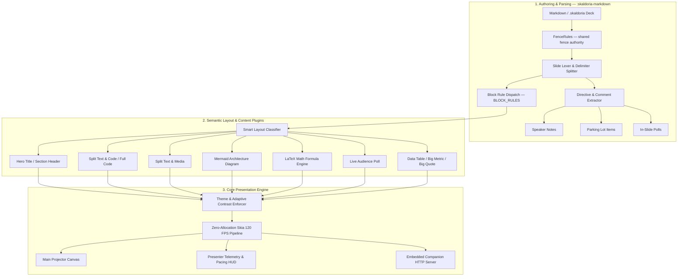

# Functional Specification: Skaldoria Presentation Studio

**Document Version:** 1.2.0
**Status:** Approved / Fully Implemented
**Target Audience:** Engineering, Product, UI/UX, Presenters

---

## 1. Executive Summary & Objective

**Skaldoria** (*The Realm of the Master Storyteller*) is a high-performance native presentation studio built with Kotlin Multiplatform and Compose Desktop running at a fluid 120 FPS. It empowers speakers and engineers to author presentations in standard Markdown while providing live stage capabilities including dual-screen presenter telemetry, algorithmic pacing ribbons, wireless mobile companion remotes, live audience polling, an integrated **Parking Lot** for unanswered questions, and strict WCAG 2.1 color contrast compliance.

### Core Architecture Pillars
- **Slides as Code:** Pure CommonMark and GitHub Flavored Markdown (GFM) compatibility.
- **Master Storyteller HUD:** Dual-screen speaker console, live notes reader, stopwatch, algorithmic pacing drift gauge, and stage blackout.
- **Audience Engagement Pipeline:** Local wireless audience polling (`/audience`) and live moderated Q&A streams.
- **Workflow Continuity:** Dedicated Parking Lot aside for tracking unanswered questions with checkboxes and expandable resolutions.
- **Color Science & Accessibility:** WCAG 2.1 AA mathematical contrast enforcement ($CR \ge 4.5:1$).

---

## 2. System Architecture & Processing Pipeline



**There is no general markdown AST.** Stage 1 is a single-pass line scanner that produces slides
directly, and that is a deliberate, measured choice: building a full CommonMark AST was benchmarked
at **2.65 µs/line** against **1.42 µs/line** for the specialised scanner — more than the whole
current per-keystroke pipeline costs. Specialisation wins here because the scanner produces exactly
what slides need and nothing else. *(Earlier revisions of this document described a "CommonMark AST
Generator" in this stage; no such component has ever existed.)*

Stage 1 lives in **`:skaldoria-markdown`**, a Gradle module with no Compose dependency, so the engine
can be compiled, tested and benchmarked without a UI toolkit.

`FenceRules` sits ahead of the lexer because fence state decides whether a `---` splits a slide or
belongs to a code sample. It is **shared grammar**: the slide lexer, the block rules and the
editor's syntax highlighter all defer to it, and `FenceLexerAgreementTest` fails if any of them
starts answering differently. Rules that are *not* shared — `SLIDE_HEADING`, `SLIDE_BREAK_RULE` —
are named for the question they ask, because the highlighter is expected to disagree with them.

---

## 3. Presentation Syntax Specification

### 3.1 Slide Delimiters
Slides are delimited using three or more dashes on their own line:
```markdown
---
```

### 3.2 Slide Directives & Annotations
```markdown
<!-- layout: hero | split-code | split-media | diagram | math | poll | table | quote | metric -->
<!-- bg: #0A0E1A or linear-gradient(...) -->
<!-- transition: fade | slide | zoom | vertical -->
<!-- note: Speaker notes displayed only on Presenter HUD -->
```

### 3.3 Parking Lot & Unanswered Questions Directives
Unanswered questions and follow-ups can be tracked directly within presentation Markdown:
```markdown
<!-- parking-lot: [ ] How is data encrypted at rest? | AES-256-GCM | slide:1 | id:6f1c2b... -->
<!-- parking-lot: [x] Can we deploy on air-gapped k8s? | Yes via Helm chart v2 | slide:2 | id:9ad4e1... -->
```

The `id:` field is written automatically and preserves identity across a reload; fields after the
question are matched by prefix, so they may appear in any order and a hand-authored directive
without an `id:` still works.

Or as standard Markdown task lists:
```markdown
- [ ] How is data encrypted at rest? (Slide 1) — Answer: AES-256-GCM
- [x] Can we deploy on air-gapped k8s? (Slide 2) — Answer: Yes via Helm chart v2
```

### 3.4 Images

```markdown


```

Relative paths resolve against the deck folder. See FR-IMG for supported sources and limits.

### 3.5 LaTeX Mathematical Formula Block
Equations are enclosed in `$$ ... $$` delimiters:
```markdown
$$ \Delta t = t_{elapsed} - \left( \frac{T_{target}}{N_{total}} \right) \cdot i_{current} $$
```

### 3.6 Live Audience Poll Directives
```markdown
<!-- poll: PostgreSQL | MongoDB | CockroachDB | MySQL | Redis -->
```

### 3.7 Fenced Code Blocks & Line Step Highlighting
````markdown
```kotlin [1-3|5-8|10-12]
val state = PresentationState()
state.addFollowUpQuestion("Throughput per shard?", slideIndex = 3)
```
````

Fence handling follows CommonMark, and one authority — `FenceRules` in `:skaldoria-markdown` — answers
for the slide parser and the editor's syntax highlighter alike.

| Rule | Behaviour |
| :--- | :--- |
| Marker | Backticks or tildes: ` ``` ` and `~~~` are equivalent |
| Length | Three or more; a fence closes only on **the same marker, at least as long** |
| Info string | Any text is accepted. The first word is the language; the rest is ignored |
| Line highlighting | `[1-3\|5-8]` after the language, as above |
| Closing fence | Carries no info string — ` ```js ` inside an open block is code, not a terminator |

Because a longer fence is needed to close a longer one, a block containing ` ``` ` can be written
by opening with ` ```` `. A `---` inside any fence is code and never splits a slide.

> **Changed.** Earlier releases recognised backtick fences only, and only with an info string of
> the form `language [1,3-5]`. Anything else — ` ```js {highlight=2} `, ` ```python title="x" ` —
> lost its language and fell back to Kotlin syntax colouring, and `~~~` blocks were not treated as
> code at all.

---

## 4. Theming & Design System Specification

### 4.1 Built-in Theme Presets
| Theme ID | Description | Primary Color | Background | Target Contrast |
| :--- | :--- | :--- | :--- | :--- |
| `skaldoria-dark` | Default Dark Studio | Cyan Blue (`#38BDF8`) | Deep Slate (`#0B0F19`) | $\ge 7.0:1$ |
| `sleek-light` | Modern Light Studio | Royal Indigo (`#4338CA`) | Pure White (`#FFFFFF`) | $\ge 4.5:1$ (Enforced) |
| `cyber-midnight` | Neon Terminal | Neon Magenta (`#EC4899`) | Obsidian (`#05050A`) | $\ge 8.0:1$ |
| `minimalist-editorial` | Editorial Serif | Warm Ochre (`#C2410C`) | Cream (`#FAF7F2`) | $\ge 4.5:1$ (Enforced) |
| `deutsche-borse` *(Restricted)* | Corporate Executive | DB Navy (`#000099`) | Clean White (`#F8FAFC`) | $\ge 7.0:1$ (Enforced) |

### 4.2 Corporate Theme Security & Access Code Gate
- The `deutsche-borse` corporate theme is gated behind an authentication dialog.

### 4.3 Adaptive Contrast Enforcer (WCAG 2.1 AA)
- Dynamically calculates relative luminance $L = 0.2126 R_L + 0.7152 G_L + 0.0722 B_L$.
- Automatically adjusts color lightness along the HSL axis using binary search to guarantee:

$$\text{Contrast Ratio} = \frac{L_1 + 0.05}{L_2 + 0.05} \ge 4.5$$

- Eliminates low-contrast visual collisions (e.g. light gray syntax on white backgrounds).

---

## 5. Functional Requirements Breakdown

### 5.1 Presentation Parking Lot & Follow-Up (FR-PARK)
- **FR-PARK-01 (Aside Drawer):** Slide-out Parking Lot panel on the right side of the editor workspace.
- **FR-PARK-02 (Interactive Checklists):** Live checkboxes for tracking answered/unanswered state and expandable text fields for recording answers.
- **FR-PARK-03 (Audience Q&A Conversion):** 1-click **Park for Later** action in Presenter View converting incoming audience questions to Parking Lot items.
- **FR-PARK-04 (Clipboard Export):** 1-click Markdown task list export to system clipboard.
- **FR-PARK-05 (Markdown as the System of Record):** The deck markdown is the only storage, so
  every mutation is written back to it before it is considered applied.
  - Deleting an item removes its `<!-- parking-lot: ... -->` comment from the source.
  - A question captured during a talk is appended to the deck, so it survives a restart.
  - Each directive carries a persisted `id:`, which is what allows an item to be re-worded,
    answered, or deleted and still be recognised as the same item after a reload. Directives
    authored by hand without an `id:` continue to work, matched on question text.
  - Directives are rewritten **in place**, so one authored beside the slide it refers to stays there.

### 5.2 Algorithmic Speaker Rhythm & Pacing (FR-PRES-06)
- **Pacing Drift Formula:**
  $$\Delta t = t_{elapsed} - \left( \frac{T_{target}}{N_{total}} \right) \cdot i_{current}$$
- **Rhythm Status Indicators:**
  - 🟢 **ON TRACK**: $|\Delta t| \le 15\text{s}$
  - 🔵 **AHEAD**: $\Delta t < -15\text{s}$
  - 🟠 **BEHIND**: $\Delta t > 20\text{s}$
  - 🔴 **OVERTIME**: $t_{elapsed} > T_{target}$

### 5.3 Mathematical Formula Rendering (FR-MATH)
- **FR-MATH-01 (Recursive Descent):** Resolves arbitrarily nested fractions (`\frac{a}{b}`), subscripts, superscripts, and parenthesized terms.
- **FR-MATH-02 (Symbol Mapping):** Maps LaTeX Greek letters (`\Delta`, `\alpha`, `\Omega`, `\pi`) and operators (`\cdot`, `\approx`, `\le`, `\ge`).

### 5.4 Mermaid Diagram Rendering (FR-DIAG)
- **FR-DIAG-01 (Flowchart Topology):** Flowcharts are laid out from the parsed graph, not from
  source order: layers assigned by longest path, cycles broken, layers compacted, and crossings
  reduced by a barycentre pass. Branches must render as branches, not as a chain.
- **FR-DIAG-02 (Flowchart Syntax):** Node shapes `[rect]`, `(round)`, `((circle))`, `{diamond}`,
  `{{hexagon}}`, `[(datastore)]`; edge labels in both `-->|text|` and mid-link `-- text -->` form;
  chained edges (`A --> B --> C`); dashed and thick arrows.
- **FR-DIAG-07 (Subgraphs):** `subgraph <id> [Title] … end` renders as a labelled frame around its
  member nodes. Nested subgraphs are flattened (a node joins the innermost declaring group), since
  the layered layout has no notion of nested containers.
- **FR-DIAG-08 (Non-Geometry Statements):** `classDef`, `class`, `style`, `linkStyle`, `click` and
  `direction` are recognised and skipped. They must never be registered as nodes — doing so
  rendered phantom boxes for keywords that appear nowhere in the source.
- **FR-DIAG-03 (Sequence Diagrams):** Rendered with lifelines and a time axis - `participant ... as`
  aliases in declaration order, all eight arrow forms (`->`, `->>`, `-->`, `-->>`, `-x`, `--x`,
  `-)`, `--)`), `loop`/`alt`/`else`/`opt`/`par`/`critical`/`rect` frames, `Note over|left of|right of`,
  activation bars, self-calls, and `autonumber`.
- **FR-DIAG-04 (Fit):** A diagram larger than the slide is scaled to fit; it must not clip.
- **FR-DIAG-05 (Out of Scope):** State, class, ER and Gantt diagrams are not supported and fall
  back to displaying the source.
- **FR-DIAG-06 (No Runtime Dependency):** Rendering is native Compose - no embedded browser,
  JavaScript engine, or network access.

### 5.5 Remote Companion & Audience Server (FR-REMOTE)
- **FR-REMOTE-01 (Zero-Dependency Socket Engine):** Built natively on `java.net.ServerSocket` in `java.base` with instant startup (<1ms) and 0 KB external footprint ([ADR-001](./docs/ADR_COMPANION_SERVER_ARCHITECTURE.md)).
- **FR-REMOTE-02 (Resilient Startup & Fallback):** Daemonized thread pool with multi-port fallback (tries preferred port through $+50$ sequential ports, then ephemeral).
- **FR-REMOTE-03 (Scoped Access Control):** Two roles with different authority, enforced server-side.
  - **Presenter scope** (`/api/action`, `/api/qa/dismiss`) requires a per-session token: 128-bit
    `SecureRandom`, regenerated on every start, cleared on stop, compared in constant time. It is
    delivered in the pairing QR and returned as an `X-Skaldoria-Token` header.
  - **Audience scope** (`/audience`, voting, question submission and upvoting) requires no token
    and can neither drive the deck nor read speaker notes - `/api/state` returns `notes` empty
    without the token.
  - **State-changing endpoints are `POST`-only.** No `Access-Control-Allow-*` header is emitted;
    the wildcard CORS previously advertised here was itself the CSRF vector, since it allowed any
    page the presenter visited to drive the deck.
  - **Untrusted-input handling:** audience text is rendered with `textContent` (never `innerHTML`),
    length-capped and rate-limited per device; the question queue is bounded; polls record one
    ballot per device so re-voting replaces rather than stacks.
  - **Resource limits:** bounded worker pool, request-line and header caps, `411` for unsupported
    chunked encoding, `413` over the body limit, `429` when rate-limited.
- **FR-REMOTE-06 (Advertised Address Selection):** The pairing URL must name an address a phone can
  actually reach. Detection prefers the interface holding the default route, excludes link-local
  (`169.254.x`) addresses, ranks hypervisor and tunnelling adapters (VirtualBox, VMware, Hyper-V,
  WSL, Docker, VPN) last, and exposes the full candidate list so the speaker can override it.
- **FR-REMOTE-04 (REST & Web Endpoints):**
  - `/remote`: Presenter clicker, notes, and live Q&A moderation.
  - `/audience`: In-slide poll voting and Q&A question submission.
  - `/api/parking-lot/add`: Remote submission of follow-up items.
- **FR-REMOTE-05 (Zero-Dependency QR Code Generator & Slide Badges):**
  - Pure Kotlin standard ISO/IEC 18004 Model 2 QR encoder (`QrCodeGenerator`) rendering directly to high-DPI Compose canvases (`QrCodeView`).
  - Interactive QR switcher in `RemotePairingDialog` for instant Speaker Remote and Audience Portal smartphone scanning.
  - High-contrast scannable QR badge embedded in the footer banner of live `PollSlide` presentations for frictionless audience participation.

### 5.6 Slide Images (FR-IMG)
- **FR-IMG-01 (Sources):** `` resolves a relative path against the deck folder (the
  project root, or the directory holding the `.md`), an absolute path, a `file:` URL, or an
  `http(s)` URL.
- **FR-IMG-02 (Refused Schemes):** `data:`, `javascript:` and any other scheme are rejected at
  resolution rather than passed to the runtime.
- **FR-IMG-03 (Bounded Fetch):** Remote images use connect and read timeouts and a 24 MB ceiling
  enforced mid-stream, so an oversized or endless response cannot be buffered into memory.
- **FR-IMG-04 (Off-Thread & Cached):** Decoding runs off the UI thread and results are cached by
  path and modification time; cancellation is propagated rather than reported as a decode failure.
- **FR-IMG-05 (Explicit Failure):** An unresolvable image shows its alt text and the reason
  (for example `File not found: assets/x.png`). A blank panel is not an acceptable outcome.

### 5.7 In-Editor Find & Replace (FR-FIND)
- **FR-FIND-01 (Interactive Find Bar):** Integrated non-modal find bar with keyboard shortcuts (<kbd>Ctrl+F</kbd>, <kbd>Ctrl+H</kbd>, <kbd>Esc</kbd>).
- **FR-FIND-02 (Matching Modes):** Supports case-sensitive matching (`Aa`), whole-word matching (`\b`), and standard regular expressions (`.*`).
- **FR-FIND-03 (Visual Highlights):** Real-time span highlighting of all matches in editor text via `MarkdownVisualTransformation`, with distinct active match indicator.
- **FR-FIND-04 (Cyclic Navigation & Replacement):** Forward (<kbd>Enter</kbd>) and backward (<kbd>Shift+Enter</kbd>) cyclic search, Single Replace, and batch Replace All.

---

## 6. Non-Functional Requirements (NFR)

| Category | Metric / Specification |
| :--- | :--- |
| **Frame Rate** | 120 FPS hardware-accelerated Skia rendering |
| **Parse Latency** | $< 15\text{ms}$ for 100 slides |
| **Accessibility** | 100% WCAG 2.1 AA Compliance ($CR \ge 4.5:1$) |
| **Memory Footprint** | $< 65\text{ MB}$ typical desktop runtime footprint |
| **Server Concurrency** | Non-blocking thread pool handling 200+ concurrent mobile poll voters |
| **Cross-Platform** | Native distributions for Windows (`.exe`, `.msi`), macOS (`.dmg`), and Linux (`.deb`, `.rpm`) |
| **Dependency Surface** | Runtime dependencies limited to Compose, coroutines and the JetBrains Markdown parser. The companion server, QR encoder and diagram engines are `java.base` only. |
| **Deprecation Policy** | The project compiles with zero deprecation warnings. Suppressing a deprecation instead of migrating is not acceptable - it hides the signal and accrues debt. |
| **Rendering Verification** | Drawing code is verified by rendering slides headlessly (`ImageComposeScene`) and asserting content reaches the canvas. A green unit-test suite and a clean launch are explicitly *not* sufficient evidence that a slide renders - a regression that blanked every slide passed both. |
