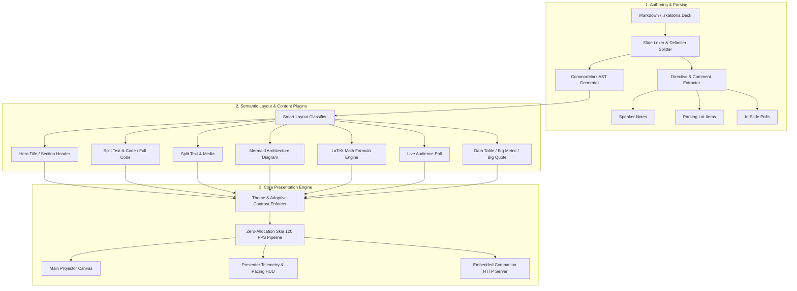

# Functional Specification: Skaldoria Presentation Studio

**Document Version:** 1.1.0  
**Status:** Approved / Fully Implemented  
**Target Audience:** Engineering, Product, UI/UX, Presenters  

---

## 1. Executive Summary & Objective

**Skaldoria** (*The Realm of the Master Storyteller*) is a high-performance native presentation studio built with Kotlin Multiplatform and Compose Desktop running at a fluid 120 FPS. It empowers speakers and engineers to author presentations in standard Markdown while providing live stage capabilities including dual-screen presenter telemetry, algorithmic pacing ribbons, wireless mobile companion remotes, live audience polling, an integrated **Parking Lot** for unanswered questions, and strict WCAG 2.1 color contrast compliance.

### Core Architecture Pillars
- **Slides as Code:** Pure CommonMark and GitHub Flavored Markdown (GFM) compatibility.
- **Master Storyteller HUD:** Dual-screen speaker console, live notes reader, stopwatch, algorithmic pacing drift gauge, and stage blackout.
- **Audience Engagement Pipeline:** Local wireless audience polling (`/audience`) and live moderated Q&A streams.
- **Workflow Continuity:** Dedicated Parking Lot aside for tracking unanswered questions with checkboxes and expandable resolutions.
- **Color Science & Accessibility:** WCAG 2.1 AA mathematical contrast enforcement ($CR \ge 4.5:1$).

---

## 2. System Architecture & Processing Pipeline



---

## 3. Presentation Syntax Specification

### 3.1 Slide Delimiters
Slides are delimited using three or more dashes on their own line:
```markdown
---
```

### 3.2 Slide Directives & Annotations
```markdown
<!-- layout: hero | split-code | split-media | diagram | math | poll | table | quote | metric -->
<!-- bg: #0A0E1A or linear-gradient(...) -->
<!-- transition: fade | slide | zoom | vertical -->
<!-- note: Speaker notes displayed only on Presenter HUD -->
```

### 3.3 Parking Lot & Unanswered Questions Directives
Unanswered questions and follow-ups can be tracked directly within presentation Markdown:
```markdown
<!-- parking-lot: [ ] How is data encrypted at rest? | AES-256-GCM | slide:1 -->
<!-- parking-lot: [x] Can we deploy on air-gapped k8s? | Yes via Helm chart v2 | slide:2 -->
```

Or as standard Markdown task lists:
```markdown
- [ ] How is data encrypted at rest? (Slide 1) — Answer: AES-256-GCM
- [x] Can we deploy on air-gapped k8s? (Slide 2) — Answer: Yes via Helm chart v2
```

### 3.4 LaTeX Mathematical Formula Block
Equations are enclosed in `$$ ... $$` delimiters:
```markdown
$$ \Delta t = t_{elapsed} - \left( \frac{T_{target}}{N_{total}} \right) \cdot i_{current} $$
```

### 3.5 Live Audience Poll Directives
```markdown
<!-- poll: PostgreSQL | MongoDB | CockroachDB | MySQL | Redis -->
```

### 3.6 Fenced Code Blocks & Line Step Highlighting
````markdown
```kotlin [1-3|5-8|10-12]
val state = PresentationState()
state.addFollowUpQuestion("Throughput per shard?", slideIndex = 3)
```
````

---

## 4. Theming & Design System Specification

### 4.1 Built-in Theme Presets
| Theme ID | Description | Primary Color | Background | Target Contrast |
| :--- | :--- | :--- | :--- | :--- |
| `skaldoria-dark` | Default Dark Studio | Cyan Blue (`#38BDF8`) | Deep Slate (`#0B0F19`) | $\ge 7.0:1$ |
| `sleek-light` | Modern Light Studio | Royal Indigo (`#4338CA`) | Pure White (`#FFFFFF`) | $\ge 4.5:1$ (Enforced) |
| `cyber-midnight` | Neon Terminal | Neon Magenta (`#EC4899`) | Obsidian (`#05050A`) | $\ge 8.0:1$ |
| `minimalist-editorial` | Editorial Serif | Warm Ochre (`#C2410C`) | Cream (`#FAF7F2`) | $\ge 4.5:1$ (Enforced) |
| `deutsche-borse` *(Restricted)* | Corporate Executive | DB Navy (`#000099`) | Clean White (`#F8FAFC`) | $\ge 7.0:1$ (Enforced) |

### 4.2 Corporate Theme Security & Access Code Gate
- The `deutsche-borse` corporate theme is gated behind an authentication dialog.
- Valid corporate codes: `DB_CORP_2026`, `deutsche-borse`, `DB_EXECUTIVE`, `DB2026`.

### 4.3 Adaptive Contrast Enforcer (WCAG 2.1 AA)
- Dynamically calculates relative luminance $L = 0.2126 R_L + 0.7152 G_L + 0.0722 B_L$.
- Automatically adjusts color lightness along the HSL axis using binary search to guarantee:

$$\text{Contrast Ratio} = \frac{L_1 + 0.05}{L_2 + 0.05} \ge 4.5$$

- Eliminates low-contrast visual collisions (e.g. light gray syntax on white backgrounds).

---

## 5. Functional Requirements Breakdown

### 5.1 Presentation Parking Lot & Follow-Up (FR-PARK)
- **FR-PARK-01 (Aside Drawer):** Slide-out Parking Lot panel on the right side of the editor workspace.
- **FR-PARK-02 (Interactive Checklists):** Live checkboxes for tracking answered/unanswered state and expandable text fields for recording answers.
- **FR-PARK-03 (Audience Q&A Conversion):** 1-click **Park for Later** action in Presenter View converting incoming audience questions to Parking Lot items.
- **FR-PARK-04 (Clipboard Export):** 1-click Markdown task list export to system clipboard.
- **FR-PARK-05 (Bi-directional Sync):** Automatically syncs between Markdown source comments and reactive state.

### 5.2 Algorithmic Speaker Rhythm & Pacing (FR-PRES-06)
- **Pacing Drift Formula:**
  $$\Delta t = t_{elapsed} - \left( \frac{T_{target}}{N_{total}} \right) \cdot i_{current}$$
- **Rhythm Status Indicators:**
  - 🟢 **ON TRACK**: $|\Delta t| \le 15\text{s}$
  - 🔵 **AHEAD**: $\Delta t < -15\text{s}$
  - 🟠 **BEHIND**: $\Delta t > 20\text{s}$
  - 🔴 **OVERTIME**: $t_{elapsed} > T_{target}$

### 5.3 Mathematical Formula Rendering (FR-MATH)
- **FR-MATH-01 (Recursive Descent):** Resolves arbitrarily nested fractions (`\frac{a}{b}`), subscripts, superscripts, and parenthesized terms.
- **FR-MATH-02 (Symbol Mapping):** Maps LaTeX Greek letters (`\Delta`, `\alpha`, `\Omega`, `\pi`) and operators (`\cdot`, `\approx`, `\le`, `\ge`).

### 5.4 Remote Companion & Audience Server (FR-REMOTE)
- **FR-REMOTE-01 (Resilient Startup):** Daemonized thread pool with multi-port fallback (tries preferred port through $+50$ sequential ports, then ephemeral).
- **FR-REMOTE-02 (CORS & Security):** Granular error boundaries with full CORS preflight support (`OPTIONS`).
- **FR-REMOTE-03 (REST & Web Endpoints):**
  - `/remote`: Presenter clicker, notes, and live Q&A moderation.
  - `/audience`: In-slide poll voting and Q&A question submission.
  - `/api/parking-lot/add`: Remote submission of follow-up items.

### 5.5 In-Editor Find & Replace (FR-FIND)
- **FR-FIND-01 (Interactive Find Bar):** Integrated non-modal find bar with keyboard shortcuts (<kbd>Ctrl+F</kbd>, <kbd>Ctrl+H</kbd>, <kbd>Esc</kbd>).
- **FR-FIND-02 (Matching Modes):** Supports case-sensitive matching (`Aa`), whole-word matching (`\b`), and standard regular expressions (`.*`).
- **FR-FIND-03 (Visual Highlights):** Real-time span highlighting of all matches in editor text via `MarkdownVisualTransformation`, with distinct active match indicator.
- **FR-FIND-04 (Cyclic Navigation & Replacement):** Forward (<kbd>Enter</kbd>) and backward (<kbd>Shift+Enter</kbd>) cyclic search, Single Replace, and batch Replace All.

---

## 6. Non-Functional Requirements (NFR)

| Category | Metric / Specification |
| :--- | :--- |
| **Frame Rate** | 120 FPS hardware-accelerated Skia rendering |
| **Parse Latency** | $< 15\text{ms}$ for 100 slides |
| **Accessibility** | 100% WCAG 2.1 AA Compliance ($CR \ge 4.5:1$) |
| **Memory Footprint** | $< 65\text{ MB}$ typical desktop runtime footprint |
| **Server Concurrency** | Non-blocking thread pool handling 200+ concurrent mobile poll voters |
| **Cross-Platform** | Native distributions for Windows (`.exe`, `.msi`), macOS (`.dmg`), and Linux (`.deb`, `.rpm`) |
