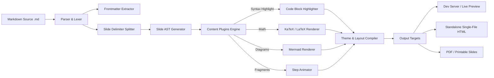
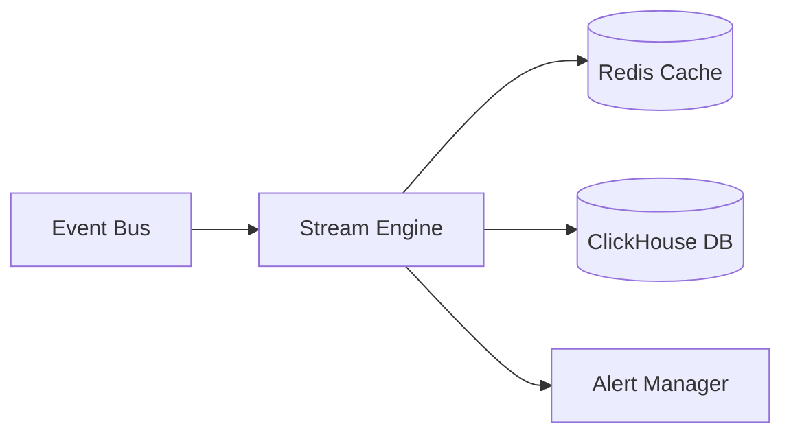

# Functional Specification: Markdown Presentation Processor

**Document Version:** 1.0.0  
**Status:** Approved / Ready for Implementation  
**Target Audience:** Engineering, Product, UI/UX, QA  

---

## 1. Executive Summary & Objective

The **Markdown Presentation Processor** (`md-pres`) is a lightweight, extensible, and developer-friendly presentation engine that parses structured Markdown files and compiles them into interactive, visually compelling, and themeable slide decks.

### Core Goals
- **Slides as Code:** Enable creators to write, version-control, and share presentation decks using familiar Markdown syntax.
- **Rich Theming & Aesthetics:** Provide sleek modern themes (Dark, Light, Corporate, Cyberpunk, Minimalist) out-of-the-box, along with full custom CSS and design-token overrides.
- **Developer & Presenter First:** Built-in presenter mode (dual-screen sync, notes, timer), code syntax highlighting with step-by-step line focus, LaTeX math rendering, and Mermaid diagram support.
- **Universal Distribution:** Output to standalone single-file HTML, interactive web presentations with live-reload, and high-resolution PDF exports.

---

## 2. System Architecture & Processing Pipeline



---

## 3. Presentation Syntax Specification

### 3.1 Document Frontmatter (YAML)
Every presentation file may begin with an optional YAML frontmatter block enclosed by `---`:

```yaml
---
title: "Modern Web Architecture"
author: "Engineering Team"
date: 2026-08-03
theme: "nord-dark" # Options: default, nord-dark, sleek-light, corporate, cyber
aspectRatio: "16:9" # Options: 16:9, 4:3, 16:10
transition: "slide" # Options: none, fade, slide, convex, concave, zoom
slideNumber: true # true | false | "c/t" (current/total)
highlightTheme: "dracula" # Code syntax highlight theme
autoSlide: 0 # Time in ms (0 = disabled)
plugins:
  - math
  - mermaid
  - line-highlight
---
```

### 3.2 Slide Delimiters & 2D Navigation
- **Horizontal Slide Delimiter:** `---` (3 or more dashes on their own line).
- **Vertical Sub-slide Delimiter:** `--` or `---v` (Allows nested drill-down slides).

```markdown
# Slide 1: Main Topic

Introduction text...

---

# Slide 2: Deep Dive (Level 1)

Overview of details...

--

## Slide 2.1: Technical Architecture (Level 2)

Deep dive details...

---

# Slide 3: Conclusion
```

### 3.3 Slide-Level Directives & Annotations
Slide attributes can be passed via HTML comments or directive comments directly following a delimiter:

```markdown
--- <!-- .slide: class="bg-gradient text-center" data-transition="zoom" data-background-color="#0f172a" -->

# Custom Styled Slide
This slide uses a custom gradient background and zoom transition.
```

### 3.4 Multi-Column and Layout Containers
Syntax for split layouts, grids, and callouts:

```markdown
::: columns
::: column
### Left Column
- Key Point A
- Key Point B
:::
::: column
### Right Column

:::
:::
```

### 3.5 Speaker Notes
Speaker notes are hidden during regular presentation and displayed exclusively in **Presenter View**:

```markdown
# Product Strategy 2026

- Expand global edge nodes
- Enhance developer tooling

::: note
- Remind audience about Q2 benchmarks.
- Do not spend more than 2 minutes on this slide.
:::
```
*(Alternative syntax supported: `Note:` or `<!-- note: ... -->`)*

### 3.6 Incremental Content (Fragments / Step-by-Step Reveal)
Items can be revealed progressively on click or forward arrow:

```markdown
# Step-by-Step Execution

1. Initialize repository <!-- .element: class="fragment" -->
2. Configure environment <!-- .element: class="fragment" -->
3. Run deployment pipeline <!-- .element: class="fragment highlight-green" -->
```

### 3.7 Rich Technical Features
1. **Code Blocks with Line Highlighting:**
   ````markdown
   ```typescript [1-2|4-6|8]
   import { createPresenter } from 'md-pres';
   import { NordTheme } from 'md-pres/themes';

   const deck = createPresenter({
     theme: NordTheme,
     transition: 'fade'
   });

   deck.start();
   ```
   ````
2. **Mathematical Notation (LaTeX / KaTeX):**
   ```markdown
   Euler's identity: $\mathrm{e}^{i\pi} + 1 = 0$
   
   $$\int_{-\infty}^{\infty} e^{-x^2} dx = \sqrt{\pi}$$
   ```
3. **Diagrams (Mermaid):**
   ````markdown
   ```mermaid
   sequenceDiagram
       Client->>Processor: Submit Markdown
       Processor->>ThemeEngine: Apply Tokens
       ThemeEngine-->>Client: Rendered Slide Deck
   ```
   ````

---

## 4. Theming & Design System Specification

### 4.1 Built-in Theme Presets
| Theme ID | Primary Palette | Background | Typography | Ideal Use-Case |
| :--- | :--- | :--- | :--- | :--- |
| `nord-dark` | Ice Blue (`#88C0D0`), White (`#ECEFF4`) | Polar Night (`#2E3440`) | `Inter`, `Fira Code` | Tech talks, developer meetups |
| `sleek-light` | Indigo (`#4F46E5`), Slate (`#334155`) | Pure White / Slate 50 (`#F8FAFC`) | `Outfit`, `JetBrains Mono` | Product launches, pitches |
| `corporate` | Navy (`#1E3A8A`), Gold (`#D97706`) | Off-white (`#F1F5F9`) | `Roboto`, `Source Code Pro` | Executive briefs, board meetings |
| `cyberpunk` | Neon Pink (`#FF007F`), Cyan (`#00F0FF`) | Deep Black (`#0A0A0F`) | `Space Grotesk`, `Share Tech Mono`| Keynotes, high-impact demos |
| `minimalist` | Monochrome (`#18181B`, `#71717A`) | Cream / Light Gray (`#FAFAFA`) | `Newsreader`, `IBM Plex Mono` | Academic, design philosophy |

### 4.2 CSS Design Tokens & Variable Overrides
Themes are powered by CSS Custom Properties, allowing instant customization via frontmatter or custom CSS files:

```css
:root {
  /* Colors */
  --pres-bg: #0f172a;
  --pres-fg: #f8fafc;
  --pres-primary: #38bdf8;
  --pres-accent: #818cf8;
  --pres-muted: #64748b;
  --pres-code-bg: #1e293b;

  /* Typography */
  --pres-font-heading: 'Outfit', sans-serif;
  --pres-font-body: 'Inter', sans-serif;
  --pres-font-mono: 'JetBrains Mono', monospace;

  /* Sizing & Spacing */
  --pres-slide-padding: 3rem 4rem;
  --pres-heading-scale: 1.35;
  --pres-border-radius: 12px;
  --pres-transition-speed: 400ms;
}
```

---

## 5. Functional Requirements Breakdown

### 5.1 Parser & Core Engine (FR-CORE)
- **FR-CORE-01 (Parsing):** Parse standard CommonMark & GFM (tables, task-lists, strikethrough, autolinks).
- **FR-CORE-02 (Frontmatter):** Parse YAML metadata at the top of documents for global presentation settings.
- **FR-CORE-03 (Slide Splitting):** Split content on `---` (horizontal) and `--` / `---v` (vertical).
- **FR-CORE-04 (Directives):** Support layout containers (`::: columns`, `::: column`, `::: note`, `::: callout`).
- **FR-CORE-05 (Attributes):** Parse slide-level and inline element attributes (`<!-- .slide: ... -->`, `<!-- .element: ... -->`).

### 5.2 Presenter Experience & Controls (FR-PRES)
- **FR-PRES-01 (Keyboard Navigation):**
  - Next slide / fragment: `Space`, `Right Arrow`, `Down Arrow`, `PageDown`, `L`.
  - Previous slide / fragment: `Left Arrow`, `Up Arrow`, `PageUp`, `H`.
  - First / Last slide: `Home`, `End`.
  - Overview / Grid mode: `Esc` or `O`.
  - Black / Blank screen: `B` or `.`.
  - Presenter View: `P`.
- **FR-PRES-02 (Presenter Dual-Screen Sync):**
  - Opens a dedicated speaker window showing:
    1. Current slide preview.
    2. Next slide / upcoming fragment preview.
    3. Elapsed time and wall clock with reset/pause timer controls.
    4. Formatted speaker notes with adjustable font size.
  - Bidirectional postMessage / BroadcastChannel synchronization across windows.
- **FR-PRES-03 (Overview Mode):** 2D grid matrix of all slides for quick random access and visual jumping.
- **FR-PRES-04 (Laser Pointer & Spotlight):** Virtual laser pointer (`Ctrl + Click` or `Tab`) and spotlight focus mode.
- **FR-PRES-05 (Drawing & Annotation):** Optional pen/highlighter layer overlay during live presentations.

### 5.3 Technical Enhancements & Rendering (FR-TECH)
- **FR-TECH-01 (Code Highlighting):** Syntax highlighting with line numbers, code block titles, copy button, and step-by-step line focus (`[1-3|5|7-10]`).
- **FR-TECH-02 (Math Processing):** Client-side KaTeX rendering for inline and block formulas without external network dependency.
- **FR-TECH-03 (Diagrams):** Dynamic SVG rendering of Mermaid syntax blocks.
- **FR-TECH-04 (Media Handling):** Responsive scaling for embedded images, local videos with autoplay on slide activate, and YouTube/Vimeo embeds.

### 5.4 CLI & Build Tooling (FR-CLI)
- **FR-CLI-01 (Dev Mode):** `md-pres dev <file.md>`
  - Starts local HTTP server with Hot Module Replacement (HMR) / Live Reload.
  - Automatically opens default browser.
- **FR-CLI-02 (Build HTML):** `md-pres build <file.md> --output dist/`
  - Compiles into a single, self-contained `index.html` file with inlined scripts, styles, and assets (ideal for offline USB/airgapped talks).
- **FR-CLI-03 (Export PDF):** `md-pres export <file.md> --format pdf --output presentation.pdf`
  - Automates headless browser rendering to generate vectorized, high-resolution slide PDFs.
- **FR-CLI-04 (Theme Customization):** `md-pres theme init <name>` to scaffold custom CSS themes.

---

## 6. Non-Functional Requirements (NFR)

| Category | Requirement | Target Metric |
| :--- | :--- | :--- |
| **Performance** | Parsing & rendering speed | < 80ms for 100 slides |
| **Animation Smoothness** | Slide transition frame rate | 60 FPS CSS Hardware accelerated |
| **Offline Capability** | Air-gapped / offline presentation support | 100% functional with zero active internet connection |
| **Cross-Platform** | OS & Browser compatibility | Chromium, Firefox, Safari, Edge on Windows, macOS, Linux |
| **Responsive Display** | Aspect ratios & resolutions | Adaptive letterbox / fit for 1080p, 4K, ultrawide, and mobile preview |
| **Accessibility** | WCAG 2.1 AA Compliance | Contrast ratios ≥ 4.5:1, screen reader slide announcements, full keyboard accessibility |

---

## 7. Complete Reference Example Document

Below is an example of an input Markdown file demonstrating the full feature set:

````markdown
---
title: "Next-Gen Data Pipelines"
author: "Antigravity Engineering"
theme: "nord-dark"
transition: "slide"
slideNumber: true
---

# Next-Gen Data Pipelines
### Building Resilient, Real-Time Systems at Scale
**Antigravity Tech Summit 2026**

::: note
Welcome everyone. Give a 30s background on why real-time data pipelines are critical today.
:::

---

## Core Challenges Today

- **Data Drift**: Schema changes break downstream consumers <!-- .element: class="fragment" -->
- **Latency Spikes**: Batch processing creates stale insights <!-- .element: class="fragment" -->
- **Operational Burden**: Complex distributed state management <!-- .element: class="fragment highlight-red" -->

---

## Architecture Comparison

::: columns
::: column
### Legacy Batch Architecture
- Hourly cron jobs
- Massive data duplication
- High recovery time objective (RTO)
:::
::: column
### Modern Streaming Pipeline
- Event-driven CDC streams
- In-memory stream processing
- Sub-second end-to-end latency
:::
:::

---

## Event Routing Logic

```rust [1-3|5-8|10-12]
pub struct EventEnvelope<T> {
    pub id: Uuid,
    pub timestamp: DateTime<Utc>,
    pub payload: T,
}

pub async fn route_event(event: EventEnvelope<LogMessage>) -> Result<()> {
    match event.payload.severity {
        Severity::Critical => push_to_alert_bus(event).await?,
        Severity::Standard => stream_to_datalake(event).await?,
    }
    Ok(())
}
```

::: note
Walk through lines 1-3 (Envelope definition), then highlight how routing branches on severity in lines 7-10.
:::

---

## Stream Topology



---

<!-- .slide: class="text-center" data-background-color="#0f172a" -->

# Thank You!
### Questions & Discussion

- GitHub: `github.com/example/md-pres`
- Documentation: `https://md-pres.dev`
````

---

## 8. Development Roadmap & Milestones

### Phase 1: MVP Core (Weeks 1–2)
- CommonMark AST parsing and `---` horizontal slide splitting.
- Base slide layout and slide navigation controller (`Next`, `Prev`, `Fullscreen`).
- 2 Default themes (`sleek-light`, `nord-dark`).
- Code syntax highlighting via Prism.js/Shiki.

### Phase 2: Rich Components & Presenter Mode (Weeks 3–4)
- Vertical sub-slides (`--` / `---v`) and 2D navigation matrix.
- Presenter View with synchronized secondary window, timer, and notes.
- Fragment progressive reveal animations.
- KaTeX mathematical formula rendering & Mermaid diagram rendering.

### Phase 3: CLI, Export & Theming Ecosystem (Weeks 5–6)
- CLI development server with Hot Module Reload (HMR).
- Single-file standalone HTML bundler.
- Headless PDF exporter via Puppeteer.
- Custom theme scaffolding and user CSS extension hooks.
