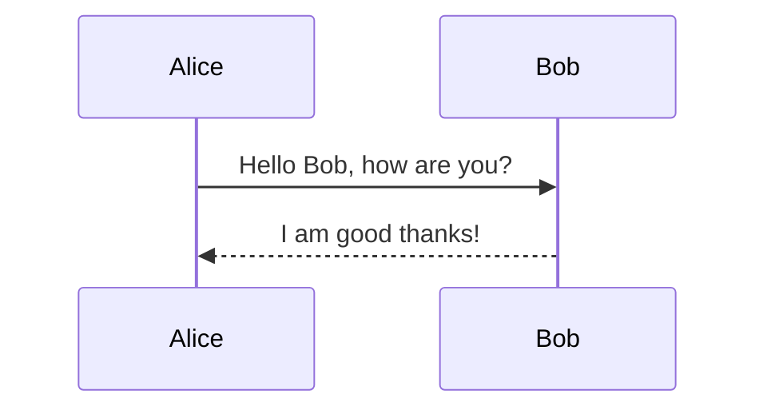

<div align="center">

# 👑 Skaldoria

**The Realm of the Master Storyteller**

*A 120 FPS native presentation studio powered by Kotlin Multiplatform & Compose Desktop.*

[](https://kotlinlang.org)
[](https://www.jetbrains.com/lp/compose-multiplatform/)
[](LICENSE)
[]()
[]()

</div>

---

## 📖 The Meaning of Skaldoria: Realm of the Storyteller

The name **Skaldoria** celebrates the timeless art of the **master orator and storyteller** — the individual who
commands the stage, weaves ideas into unforgettable narratives, and holds audiences captivated from the opening sentence
to the final question.

Combined with the domain suffix **-oria** (*creative realm* or *sanctuary*), **Skaldoria** represents:

> **"The Realm of the Master Storyteller"**

In modern technical and executive communication, you are that storyteller:

- **Story Over Menus**: Write your vision in pure, standard Markdown.
- **Commanding Delivery**: Dual-screen Presenter HUD, wireless mobile companion control, real-time audience polling,
  live canvas annotations, and an integrated **Parking Lot** for unanswered questions.
- **Algorithmic Speaker Rhythm**: Real-time pacing telemetry keeping talks on schedule.
- **Distraction-Free Speed**: 120 FPS hardware-accelerated Compose rendering engine with zero lag.

---

## ⚡ Key Features & Innovations

### 1. 🅿️ Presentation Parking Lot & Unanswered Questions (Aside Feature)
- **Built-in Workspace Aside**: Dedicated slide-out drawer on the right side of the editor for capturing live questions and action items.
- **Interactive Checklists**: Checkboxes for toggling answered/unanswered status, with expandable answer resolution notes.
- **Presenter Console Tab**: Live Parking Lot tab in the presenter HUD with 1-click **Park for Later** conversion from incoming audience Q&A questions.
- **The markdown is the storage**: items are read from *and written back to* the deck. Deleting a
  question removes its `<!-- parking-lot: … -->` comment from the file; a question captured during
  the talk is appended to the deck with a persisted `id:` so it survives a restart, and editing its
  wording stays an edit rather than becoming a new item.
- **One-Click Export**: Export the full follow-up checklist to the clipboard as clean Markdown.

### 2. ⏱️ Algorithmic Speaker Rhythm & Pacing Formula
- Skaldoria monitors presentation pacing using an algorithmic drift formula:

$$\Delta t = t_{elapsed} - \left( \frac{T_{target}}{N_{total}} \right) \cdot i_{current}$$

- **Live Visual Gauge**:
  - 🟢 **ON TRACK** (Emerald): Within $\pm15\text{s}$ of target pace
  - 🔵 **AHEAD** (Cyan): Ahead of target schedule
  - 🟠 **BEHIND** (Amber): $>20\text{s}$ behind schedule
  - 🔴 **OVERTIME** (Red): Total allocated talk duration exceeded

### 3. 🧮 LaTeX Mathematical Formula Engine
- Recursive-descent bracket matching supporting complex multi-line and nested equations.
- Full support for fractions (`\frac{a}{b}`), roots (`\sqrt{x}`), Greek symbols (`\alpha`, `\beta`, `\Delta`, `\Omega`), calculus operators (`\sum`, `\int`, `\prod`), and subscripts/superscripts (`t_{elapsed}`, `e^{-i\pi}`).

### 4. 🔒 Enterprise Corporate Themes & Adaptive Contrast Science
- **WCAG 2.1 AA Adaptive Contrast Enforcer**: Mathematical color contrast enforcer calculating relative luminance and adjusting HSL lightness to guarantee a contrast ratio $CR \ge 4.5:1$ across all light surfaces and editor syntax tokens.

### 5. 📊 Live Audience Interaction (In-Slide Polls & Real-Time Q&A)
- **Live In-Slide Polling**: Embed polls directly in Markdown using `<!-- poll: Option A | Option B | Option C -->`.
- **Real-Time Bar Graphs**: Audience votes from their mobile phones via `/audience`, and results
  animate in real time on the big screen!
- **Audience Q&A Stream**: Audience members submit and upvote questions live; speakers review, moderate, and answer or
  defer to the Parking Lot.

### 6. 📱 Wireless Mobile Remote & Companion Server

- Embedded daemonized HTTP server with automatic multi-port fallback (tries port 8888 through 8938, then ephemeral).
- **Presenter Remote (`/remote`)**: Next/Prev slide, live notes, stopwatch timer, blackout (`B`), and live Q&A moderation.
- **Audience Portal (`/audience`)**: Vote in active polls and submit questions from any smartphone on the local network.
- **Network address picker**: on machines with VirtualBox / VMware / Hyper-V / VPN adapters, the
  QR would otherwise advertise a host-only address no phone can reach. Skaldoria detects the
  adapter carrying the default route, ranks virtual adapters last, and lets you override the
  choice in the pairing dialog.

### 6b. 🔐 Companion Security Model

The companion binds to your local network, so the two roles are separated deliberately:

| | Speaker link | Audience link |
|---|---|---|
| Carries a session token | ✅ (treat it like a password) | ❌ by design |
| Drive the deck (next / jump / blackout / timer) | ✅ | ❌ `401` |
| Read speaker notes | ✅ | ❌ notes returned empty |
| Vote in polls, ask & upvote questions | ✅ | ✅ |
| Dismiss questions | ✅ | ❌ `401` |

- **Per-session token**: 128-bit `SecureRandom`, regenerated on every server start and cleared on
  stop — so a previously shared QR code stops working. Compared in constant time.
- **State-changing endpoints are `POST`-only** and require the token in an `X-Skaldoria-Token`
  header, which forces a CORS preflight and closes drive-by requests from any page you visit.
- **No CORS headers are emitted.** The portals are same-origin and do not need them.
- **Audience input is never trusted**: rendered with `textContent` (never `innerHTML`), length-capped,
  rate-limited per device, and the question queue is bounded.
- **One ballot per device** — voting again replaces your choice instead of stacking.

> The companion is meant for a room you control. It is not hardened for the open internet, and it
> speaks plain HTTP so phones can connect without certificate warnings — see
> [ADR-001](./docs/ADR_COMPANION_SERVER_ARCHITECTURE.md).

### 7. 🧜‍♂️ Mermaid Diagrams — Rendered Natively
- **Flowcharts** laid out from the real graph: a layered (Sugiyama-style) engine assigns layers by
  longest path and reduces edge crossings, so branches fan out instead of queuing in a line.
  Node shapes `[rect]`, `(round)`, `((circle))`, `{diamond}`, `{{hexagon}}`, `[(datastore)]`;
  labels in both `-->|text|` and mid-link `-- text -->` form.
- **`subgraph … end` clusters** are drawn as labelled frames around their members. `classDef`,
  `class`, `style`, `linkStyle`, `click` and `direction` are recognised and skipped rather than
  being mistaken for nodes.
- **Sequence diagrams** with real lifelines and time axis: `participant … as` aliases, all eight
  arrow types (`->`, `->>`, `-->`, `-->>`, `-x`, `--x`, `-)`, `--)`), `loop` / `alt` / `else` /
  `opt` / `par` frames, `Note over|left of|right of`, activation bars, self-calls, and `autonumber`.
- Diagrams scale to fit the slide rather than clipping.
- Rendered by a native Compose engine — no browser, no JavaScript, no network.

State, class, ER and Gantt diagrams are **not** supported; those blocks fall back to showing the
source. Nested subgraphs are flattened — a node joins the innermost group that declared it.
Write diagrams directly in a fenced block:
  ```markdown
  ```mermaid
  graph TD
      A[Client] -->|HTTP Request| B[API Gateway]
      B --> C[Microservice Alpha]
      B --> D[Microservice Beta]
  ```
  ```

### 8. 📄 Standalone HTML & PDF Export

- Export complete decks to single-file self-contained HTML presentations with embedded KaTeX, Mermaid JS, and
  customizable themes.
- One-click print-to-PDF ready.

### 9. 🎨 10+ Intelligent Slide Layouts
- Automatic heuristic classification detects:
  - **Hero Title Slides** & **Section Headers**
  - **Split Text & Code** / **Full Code** (with line highlights `[1-3|5]`)
  - **Split Text & Media** — images load from the deck folder or an `http(s)` URL
  - **Big Metric** & **Big Quote**
  - **Data Tables**
  - **Diagrams** (Mermaid)
  - **Math Formulas** (LaTeX)
  - **Live Polls**

---

## 🚀 Quick Start

### Running from Source

```bash
# Clone the repository
git clone https://github.com/yourusername/skaldoria.git
cd skaldoria

# Run desktop application via Gradle
./gradlew run
```

### Running Unit Tests

```bash
./gradlew desktopTest
```

### Packaging Standalone Native Executable

```bash
./gradlew createDistributable
# Output directory: build/compose/binaries/main/app/Skaldoria/Skaldoria.exe
```

---

## ⌨️ Keyboard Shortcuts

| Shortcut                                                        | Action                                                                                                 |
|:----------------------------------------------------------------|:-------------------------------------------------------------------------------------------------------|
| <kbd>F5</kbd>                                                   | Launch Fullscreen Presentation Mode                                                                    |
| <kbd>P</kbd>                                                    | Launch Presenter Console & Notes Window                                                                |
| <kbd>Ctrl</kbd> + <kbd>K</kbd>                                  | Open Spotlight Command Palette                                                                         |
| <kbd>Ctrl</kbd> + <kbd>F</kbd> | Find in Slide Source Editor |
| <kbd>Ctrl</kbd> + <kbd>H</kbd> | Find & Replace in Slide Source Editor |
| <kbd>Ctrl</kbd> + <kbd>O</kbd>                                  | Open Markdown File, Directory, or `.mdpres` Project                                                    |
| <kbd>Ctrl</kbd> + <kbd>S</kbd>                                  | Save Current Slide / Project                                                                           |
| <kbd>Ctrl</kbd> + <kbd>E</kbd>                                  | Export to Self-Contained HTML / PDF                                                                    |
| <kbd>Ctrl</kbd> + <kbd>+</kbd> / <kbd>Ctrl</kbd> + <kbd>−</kbd> | Zoom Editor Font In / Out                                                                              |
| <kbd>Ctrl</kbd> + <kbd>0</kbd>                                  | Reset Editor Font Size                                                                                 |
| <kbd>→</kbd> / <kbd>Space</kbd> / <kbd>PageDown</kbd>           | Next Slide                                                                                             |
| <kbd>←</kbd> / <kbd>Backspace</kbd> / <kbd>PageUp</kbd>         | Previous Slide                                                                                         |
| <kbd>Home</kbd> / <kbd>End</kbd>                                | Jump to First / Last Slide                                                                             |
| <kbd>B</kbd> | Blackout Screen (Stage Focus) |
| <kbd>W</kbd>                                                    | Whiteout / Annotation Canvas Mode                                                                      |
| <kbd>T</kbd> | Cycle Color Themes |
| <kbd>Esc</kbd>                                                  | Exit Fullscreen / Close Modal                                                                          |

---

## 📝 Markdown Directives Quick Reference

### Slide Separator

```markdown
---
```

### Speaker Notes

```markdown
<!-- note: Remind the team about latency milestones -->
```

### Parking Lot Follow-Up Item
```markdown
<!-- parking-lot: [ ] What is the throughput per shard? | slide:4 -->
<!-- parking-lot: [x] Can we run on air-gapped k8s? | Yes, via offline Helm bundle | slide:2 -->
```

### In-Slide Live Poll

```markdown
<!-- poll: PostgreSQL | MongoDB | CockroachDB | Redis -->
```

### Diagrams (Mermaid)

````markdown

````

### Images

```markdown


```

Relative paths resolve against the deck folder (the project root, or the folder holding the
`.md`). Absolute paths and `http(s)` URLs work too; remote fetches are bounded by a timeout and
a size cap. A path that cannot be resolved shows the alt text and the reason rather than a
blank panel.

### Parking Lot item with a stable id

```markdown
<!-- parking-lot: [ ] What is the throughput per shard? | slide:4 | id:6f1c2b… -->
```

The `id:` is written automatically. It is what lets a question be re-worded, answered, or
deleted and still be recognised as the same question after a reload.

### Mathematical Formula (LaTeX)
```markdown
$$ \Delta t = t_{elapsed} - \left( \frac{T_{target}}{N_{total}} \right) \cdot i_{current} $$
```

---

## 📁 Modular Project Structure (`.skaldoria` / `.mdpres`)

For large presentations, Skaldoria supports splitting decks into individual slide files organized by a lightweight
manifest:

```
my_presentation/
├── deck.mdpres                 # Project manifest (JSON: name, theme, transition, slides[])
├── assets/                     # Images referenced by relative path
│   └── architecture.png
└── slides/
    ├── 01_intro.md
    ├── 02_architecture.md
    ├── 03_live_poll.md
    ├── 04_math_pacing.md
    └── 05_benchmarks.md
```

Open a project with **Ctrl+O** and select its `deck.mdpres`. A file is treated as a project only
if it genuinely parses as a manifest *and* declares slides that resolve inside the project — an
unrelated `.json` opens as a plain file rather than being mistaken for a deck.

### Bundled example decks

| Deck | Purpose |
|---|---|
| [`examples/companion_test_deck`](./examples/companion_test_deck) | **Start here.** 17 slides covering every layout, with two live polls, Q&A, and a seeded parking lot — built for testing the phone companion. See its [README](./examples/companion_test_deck/README.md). |
| [`examples/modular_project_deck`](./examples/modular_project_deck) | A smaller multi-file project showing the manifest layout. |

---

## 📚 Documentation & Guides

* 📘 **[Comprehensive User Guide & Feature Manual](./docs/USER_GUIDE.md)**: Full walkthrough of slide authoring, layouts, presenter console, wireless companions, and parking lot.
* 📋 **[Functional Specification](./FUNCTIONAL_SPECIFICATION.md)**: Formal requirements and system architecture.
* 📐 **[ADR-001: Companion Server Architecture](./docs/ADR_COMPANION_SERVER_ARCHITECTURE.md)**: Technical evaluation of native sockets vs Ktor and HTTP/1.1 vs HTTP/2.
* 🚀 **[Changelog](./CHANGELOG.md)**: Release history and version updates.
* 📐 **[ADR-002: Diagram Geometry Architecture](./docs/ADR_DIAGRAM_GEOMETRY_ARCHITECTURE.md)**: How diagram layout is separated from drawing.
* 🔍 **[Ktor vs. hand-rolled sockets](./docs/KTOR_MIGRATION_TRADEOFFS.md)**: Measured evaluation of replacing the companion server, and why it stayed.
* 🖼️ **[Rendering status](./docs/RENDERING_STATUS.md)**: What has been visually verified, with the headless render harness that proves it.
* 🧭 **[Remediation plan](./docs/REMEDIATION_PLAN.md)**: The full defect register — every item, its root cause, and how it was fixed.

---

## 📜 License

MIT License. Designed with precision for speakers, engineers, and master storytellers worldwide.
