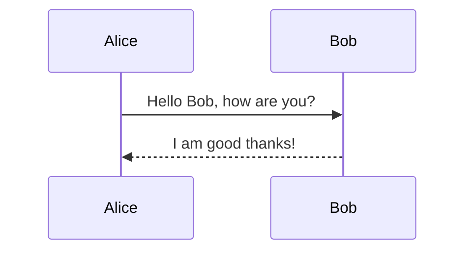

<div align="center">

# 👑 Skaldoria

**The Realm of the Master Storyteller**

*A 120 FPS native presentation studio powered by Kotlin Multiplatform & Compose Desktop.*

[](https://kotlinlang.org)
[](https://www.jetbrains.com/lp/compose-multiplatform/)
[](LICENSE)
[]()
[]()

</div>

---

## 📖 The Meaning of Skaldoria: Realm of the Storyteller

The name **Skaldoria** celebrates the timeless art of the **master orator and storyteller** — the individual who commands the stage, weaves ideas into unforgettable narratives, and holds audiences captivated from the opening sentence to the final question.

Combined with the domain suffix **-oria** (*creative realm* or *sanctuary*), **Skaldoria** represents:

> **"The Realm of the Master Storyteller"**

In modern technical and executive communication, you are that storyteller:
- **Story Over Menus**: Write your vision in pure, standard Markdown.
- **Commanding Delivery**: Dual-screen Presenter HUD, wireless mobile companion control, real-time audience polling, live canvas annotations, and an integrated **Parking Lot** for unanswered questions.
- **Algorithmic Speaker Rhythm**: Real-time pacing telemetry keeping talks on schedule.
- **Distraction-Free Speed**: 120 FPS hardware-accelerated Compose rendering engine with zero lag.

---

## ⚡ Key Features & Innovations

### 1. 🅿️ Presentation Parking Lot & Unanswered Questions (Aside Feature)
- **Built-in Workspace Aside**: Dedicated slide-out drawer on the right side of the editor for capturing live questions and action items.
- **Interactive Checklists**: Checkboxes for toggling answered/unanswered status, with expandable answer resolution notes.
- **Presenter Console Tab**: Live Parking Lot tab in the presenter HUD with 1-click **Park for Later** conversion from incoming audience Q&A questions.
- **Bi-directional Markdown Persistence**: Seamlessly parse and persist items via HTML comments (`<!-- parking-lot: [ ] Question | Answer | slide:3 -->`) or Markdown task lists.
- **One-Click Export**: Export the full follow-up checklist to the clipboard as clean Markdown.

### 2. ⏱️ Algorithmic Speaker Rhythm & Pacing Formula
- Skaldoria monitors presentation pacing using an algorithmic drift formula:

$$\Delta t = t_{elapsed} - \left( \frac{T_{target}}{N_{total}} \right) \cdot i_{current}$$

- **Live Visual Gauge**:
  - 🟢 **ON TRACK** (Emerald): Within $\pm15\text{s}$ of target pace
  - 🔵 **AHEAD** (Cyan): Ahead of target schedule
  - 🟠 **BEHIND** (Amber): $>20\text{s}$ behind schedule
  - 🔴 **OVERTIME** (Red): Total allocated talk duration exceeded

### 3. 🧮 LaTeX Mathematical Formula Engine
- Recursive-descent bracket matching supporting complex multi-line and nested equations.
- Full support for fractions (`\frac{a}{b}`), roots (`\sqrt{x}`), Greek symbols (`\alpha`, `\beta`, `\Delta`, `\Omega`), calculus operators (`\sum`, `\int`, `\prod`), and subscripts/superscripts (`t_{elapsed}`, `e^{-i\pi}`).

### 4. 🔒 Enterprise Corporate Themes & Adaptive Contrast Science
- **Corporate Access Code Gate**: Institutional themes (such as "Deutsche Börse Executive") are protected behind secure access codes (`DB_CORP_2026`).
- **WCAG 2.1 AA Adaptive Contrast Enforcer**: Mathematical color contrast enforcer calculating relative luminance and adjusting HSL lightness to guarantee a contrast ratio $CR \ge 4.5:1$ across all light surfaces and editor syntax tokens.

### 5. 📊 Live Audience Interaction (In-Slide Polls & Real-Time Q&A)
- **Live In-Slide Polling**: Embed polls directly in Markdown using `<!-- poll: Option A | Option B | Option C -->`.
- **Real-Time Bar Graphs**: Audience votes from their mobile phones via `/audience`, and results animate in real time on the big screen!
- **Audience Q&A Stream**: Audience members submit and upvote questions live; speakers review, moderate, and answer or defer to the Parking Lot.

### 6. 📱 Wireless Mobile Remote & Resilient Companion Server
- Embedded daemonized HTTP server with automatic multi-port fallback (tries port 8888 through 8938, then ephemeral).
- **Presenter Remote (`/remote`)**: Next/Prev slide, live notes, stopwatch timer, blackout (`B`), and live Q&A moderation.
- **Audience Portal (`/audience`)**: Vote in active polls and submit questions from any smartphone on the local network.

### 7. 🧜‍♂️ Mermaid JS Diagrams & Architecture Charts
- Create flowcharts, sequence diagrams, state machines, and class hierarchies directly in code blocks:
  ```markdown
  ```mermaid
  graph TD
      A[Client] -->|HTTP Request| B[API Gateway]
      B --> C[Microservice Alpha]
      B --> D[Microservice Beta]
  ```
  ```

### 8. 📄 Standalone HTML & PDF Export
- Export complete decks to single-file self-contained HTML presentations with embedded KaTeX, Mermaid JS, and customizable themes.
- One-click print-to-PDF ready.

### 9. 🎨 10+ Intelligent Slide Layouts
- Automatic heuristic classification detects:
  - **Hero Title Slides** & **Section Headers**
  - **Split Text & Code** / **Full Code** (with line highlights `[1-3|5]`)
  - **Split Text & Media** (Images, Videos)
  - **Big Metric** & **Big Quote**
  - **Data Tables**
  - **Diagrams** (Mermaid)
  - **Math Formulas** (LaTeX)
  - **Live Polls**

---

## 🚀 Quick Start

### Running from Source
```bash
# Clone the repository
git clone https://github.com/yourusername/skaldoria.git
cd skaldoria

# Run desktop application via Gradle
./gradlew run
```

### Running Unit Tests
```bash
./gradlew desktopTest
```

### Packaging Standalone Native Executable
```bash
./gradlew createDistributable
# Output directory: build/compose/binaries/main/app/Skaldoria/Skaldoria.exe
```

---

## ⌨️ Keyboard Shortcuts

| Shortcut | Action |
| :--- | :--- |
| <kbd>F5</kbd> | Launch Fullscreen Presentation Mode |
| <kbd>P</kbd> | Launch Presenter Console & Notes Window |
| <kbd>Ctrl</kbd> + <kbd>K</kbd> | Open Spotlight Command Palette |
| <kbd>Ctrl</kbd> + <kbd>F</kbd> | Find in Slide Source Editor |
| <kbd>Ctrl</kbd> + <kbd>H</kbd> | Find & Replace in Slide Source Editor |
| <kbd>Ctrl</kbd> + <kbd>O</kbd> | Open Markdown File, Directory, or `.mdpres` Project |
| <kbd>Ctrl</kbd> + <kbd>S</kbd> | Save Current Slide / Project |
| <kbd>Ctrl</kbd> + <kbd>E</kbd> | Export to Self-Contained HTML / PDF |
| <kbd>Ctrl</kbd> + <kbd>+</kbd> / <kbd>Ctrl</kbd> + <kbd>−</kbd> | Zoom Editor Font In / Out |
| <kbd>Ctrl</kbd> + <kbd>0</kbd> | Reset Editor Font Size |
| <kbd>→</kbd> / <kbd>Space</kbd> / <kbd>PageDown</kbd> | Next Slide |
| <kbd>←</kbd> / <kbd>Backspace</kbd> / <kbd>PageUp</kbd> | Previous Slide |
| <kbd>Home</kbd> / <kbd>End</kbd> | Jump to First / Last Slide |
| <kbd>B</kbd> | Blackout Screen (Stage Focus) |
| <kbd>W</kbd> | Whiteout / Annotation Canvas Mode |
| <kbd>T</kbd> | Cycle Color Themes |
| <kbd>Esc</kbd> | Exit Fullscreen / Close Modal |

---

## 📝 Markdown Directives Quick Reference

### Slide Separator
```markdown
---
```

### Speaker Notes
```markdown
<!-- note: Remind the team about latency milestones -->
```

### Parking Lot Follow-Up Item
```markdown
<!-- parking-lot: [ ] What is the throughput per shard? | slide:4 -->
<!-- parking-lot: [x] Can we run on air-gapped k8s? | Yes, via offline Helm bundle | slide:2 -->
```

### In-Slide Live Poll
```markdown
<!-- poll: PostgreSQL | MongoDB | CockroachDB | Redis -->
```

### Diagrams (Mermaid)
````markdown

````

### Mathematical Formula (LaTeX)
```markdown
$$ \Delta t = t_{elapsed} - \left( \frac{T_{target}}{N_{total}} \right) \cdot i_{current} $$
```

---

## 📁 Modular Project Structure (`.skaldoria` / `.mdpres`)

For large presentations, Skaldoria supports splitting decks into individual slide files organized by a lightweight manifest:

```
my_presentation/
├── deck.skaldoria              # Project manifest
└── slides/
    ├── 01_intro.md
    ├── 02_architecture.md
    ├── 03_live_poll.md
    ├── 04_math_pacing.md
    └── 05_benchmarks.md
```

---

## 📜 License

MIT License. Designed with precision for speakers, engineers, and master storytellers worldwide.
