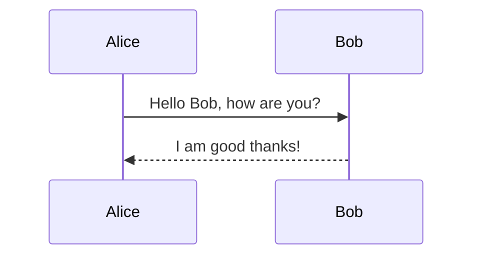

<div align="center">

# 👑 Skaldoria

**The Realm of the Master Storyteller**

*A 120 FPS native presentation studio powered by Kotlin Multiplatform & Compose Desktop.*

[](https://kotlinlang.org)
[](https://www.jetbrains.com/lp/compose-multiplatform/)
[](LICENSE)
[]()

</div>

---

## 📖 The Meaning of Skaldoria: Realm of the Storyteller

The name **Skaldoria** celebrates the timeless art of the **master orator and storyteller** — the individual who commands the stage, weaves ideas into unforgettable narratives, and holds audiences captivated from the opening sentence to the final question.

Combined with the domain suffix **-oria** (*creative realm* or *sanctuary*), **Skaldoria** represents:

> **"The Realm of the Master Storyteller"**

In modern technical and creative communication, you are that storyteller:
- **Story Over Complex Menus**: Write your vision in pure, natural Markdown.
- **Commanding Delivery**: Dual-screen Presenter HUD, wireless mobile companion control, real-time audience polling, and live canvas annotations.
- **Distraction-Free Speed**: 120 FPS hardware-accelerated Compose rendering engine with zero lag.

---

## ⚡ Key Features & Innovations

### 1. 📊 Live Audience Interaction (In-Slide Polls & Real-Time Q&A)
- **Live In-Slide Polling**: Embed polls directly in Markdown using `<!-- poll: Option A | Option B | Option C -->`.
- **Real-Time Bar Graphs**: Audience votes from their mobile phones via the companion web app (`/audience`), and results animate in real time on the big screen!
- **Audience Q&A Stream**: Audience members submit and upvote questions live; speakers review, moderate, and dismiss or mark them answered in Presenter View.

### 2. 🧮 KaTeX Math Equations & Formulas
- Write LaTeX formulas using `$$...$$` syntax.
- Renders high-fidelity mathematical formulas natively on desktop slides and in exported HTML/PDF decks.

### 3. 🧜‍♂️ Mermaid JS Diagrams & Architecture Charts
- Create flowcharts, sequence diagrams, state machines, and class hierarchies directly in code blocks:
  ```markdown
  ```mermaid
  graph TD
      A[Client] -->|HTTP Request| B[API Gateway]
      B --> C[Microservice Alpha]
      B --> D[Microservice Beta]
  ```
  ```

### 4. ⏱️ Presenter Pacing Gauge & Delivery Ribbon
- Set your target presentation duration (e.g. 20 minutes) and see real-time pacing feedback:
  - 🟢 **On Track** (±10s)
  - 🟡 **Running Ahead / Slightly Behind**
  - 🔴 **Pacing Alert** (Overtime Warning)

### 5. 📱 Wireless Mobile Remote & Audience Server
- Embedded zero-dependency HTTP server with automatic port-fallback if port 8888 is busy.
- **Presenter Remote (`/remote`)**: Next/Prev slide, live notes, stopwatch timer, blackout (`B`), and live Q&A moderation.
- **Audience Portal (`/audience`)**: Vote in active polls and submit questions from any smartphone on the local network.

### 6. 📄 Standalone HTML & PDF Export
- Export complete decks to single-file self-contained HTML presentations with embedded KaTeX, Mermaid JS, and customizable themes.
- One-click print-to-PDF ready.

### 7. 🎨 10+ Intelligent Slide Layouts
- Automatic heuristic classification detects:
  - **Hero Title Slides** & **Section Headers**
  - **Split Text & Code** / **Full Code** (with syntax highlighting)
  - **Split Text & Media** (Images, Videos)
  - **Big Metric** & **Big Quote**
  - **Data Tables**
  - **Diagrams** (Mermaid)
  - **Math Formulas** (KaTeX)
  - **Live Polls**

---

## 🚀 Quick Start

### Running from Source
```bash
# Clone the repository
git clone https://github.com/yourusername/skaldoria.git
cd skaldoria

# Run desktop application via Gradle
./gradlew run
```

### Running Unit Tests
```bash
./gradlew desktopTest
```

### Packaging Standalone Native Executable
```bash
./gradlew createDistributable
# Output directory: build/compose/binaries/main/app/Skaldoria/Skaldoria.exe
```

---

## ⌨️ Keyboard Shortcuts

| Shortcut | Action |
| :--- | :--- |
| <kbd>F5</kbd> | Launch Fullscreen Presentation Mode |
| <kbd>P</kbd> | Launch Presenter Console & Notes Window |
| <kbd>Ctrl</kbd> + <kbd>K</kbd> | Open Spotlight Command Palette |
| <kbd>Ctrl</kbd> + <kbd>O</kbd> | Open Markdown File, Directory, or `.mdpres` Project |
| <kbd>Ctrl</kbd> + <kbd>S</kbd> | Save Current Slide / Project |
| <kbd>Ctrl</kbd> + <kbd>E</kbd> | Export to Self-Contained HTML / PDF |
| <kbd>Ctrl</kbd> + <kbd>+</kbd> / <kbd>Ctrl</kbd> + <kbd>−</kbd> | Zoom Editor Font In / Out |
| <kbd>Ctrl</kbd> + <kbd>0</kbd> | Reset Editor Font Size |
| <kbd>→</kbd> / <kbd>Space</kbd> / <kbd>PageDown</kbd> | Next Slide |
| <kbd>←</kbd> / <kbd>Backspace</kbd> / <kbd>PageUp</kbd> | Previous Slide |
| <kbd>Home</kbd> / <kbd>End</kbd> | Jump to First / Last Slide |
| <kbd>B</kbd> | Blackout Screen |
| <kbd>W</kbd> | Whiteout / Annotation Canvas Mode |
| <kbd>T</kbd> | Cycle Color Themes (Skaldoria Dark, Sleek Light, Cyber Midnight, Minimalist Editorial, Executive Blue) |
| <kbd>Esc</kbd> | Exit Fullscreen / Close Modal |

---

## 📝 Markdown Directives Quick Reference

### Slide Separator
```markdown
---
```

### Speaker Notes
```markdown
<!-- note: Remind the team about latency milestones -->
```

### In-Slide Live Poll
```markdown
<!-- poll: PostgreSQL | MongoDB | CockroachDB | Redis -->
```

### Diagrams (Mermaid)
````markdown

````

### Mathematical Formula (KaTeX)
```markdown
$$
\int_{-\infty}^{\infty} e^{-x^2} dx = \sqrt{\pi}
$$
```

---

## 📁 Modular Project Structure (`.mdpres`)

For large presentations, Skaldoria supports splitting decks into individual slide files organized by a lightweight manifest:

```
my_presentation/
├── deck.mdpres                 # Project manifest
└── slides/
    ├── 01_intro.md
    ├── 02_architecture.md
    ├── 03_live_poll.md
    └── 04_benchmarks.md
```

---

## 📜 License

MIT License. Designed with precision for speakers, engineers, and master storytellers worldwide.
