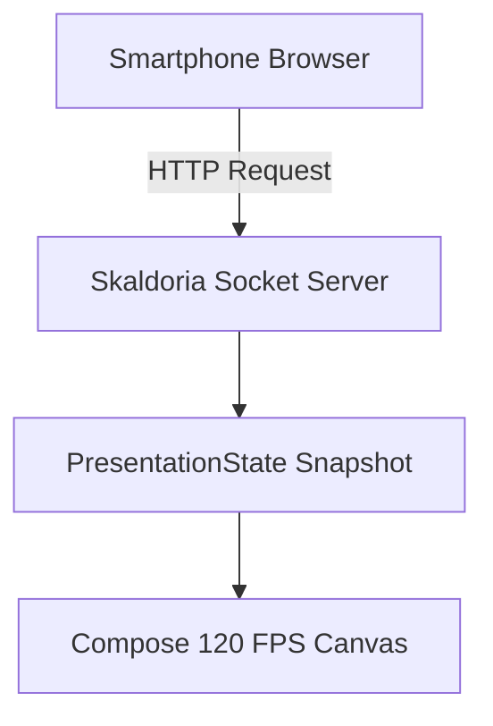

# 👑 Skaldoria — Comprehensive User Guide & Feature Manual

**The Realm of the Master Storyteller**  
*A 120 FPS native presentation studio powered by Kotlin Multiplatform & Compose Desktop.*

---

## 📑 Table of Contents

1. [Introduction & Philosophy](#1-introduction--philosophy)
2. [Quick Start & Workspace Overview](#2-quick-start--workspace-overview)
3. [Slide Authoring Syntax & Layouts](#3-slide-authoring-syntax--layouts)
   - [Basic Markdown Syntax & Slide Delimiters](#basic-markdown-syntax--slide-delimiters)
   - [Intelligent Layout Engine](#intelligent-layout-engine)
   - [Code Blocks with Step-by-Step Line Highlighting](#code-blocks-with-step-by-step-line-highlighting)
   - [Mermaid JS Architecture & Flow Diagrams](#mermaid-js-architecture--flow-diagrams)
   - [LaTeX Mathematical Formula Rendering](#latex-mathematical-formula-rendering)
   - [Speaker Notes (`::: notes`)](#speaker-notes--notes)
   - [Live In-Slide Audience Polls (`<!-- poll: ... -->`)](#live-in-slide-audience-polls---poll--)
4. [In-Editor Find & Replace (<kbd>Ctrl+F</kbd> / <kbd>Ctrl+H</kbd>)](#4-in-editor-find--replace)
5. [Presentation Parking Lot & Unanswered Questions](#5-presentation-parking-lot--unanswered-questions)
   - [Capturing in the Editor Aside Drawer](#capturing-in-the-editor-aside-drawer)
   - [Live Capture in Presenter View](#live-capture-in-presenter-view)
   - [Converting Incoming Audience Q&A to Parking Lot](#converting-incoming-audience-qa-to-parking-lot)
   - [Markdown Persistence Format](#markdown-persistence-format)
6. [Dual-Screen Presenter Console (<kbd>P</kbd>)](#6-dual-screen-presenter-console)
   - [HUD Layout & Upcoming Slide Preview](#hud-layout--upcoming-slide-preview)
   - [Algorithmic Speaker Rhythm & Pacing Ribbon](#algorithmic-speaker-rhythm--pacing-ribbon)
   - [Slide Grid Overview (<kbd>G</kbd>)](#slide-grid-overview-kbdgkbd)
   - [Presentation Blackout (<kbd>B</kbd>) & Whiteout (<kbd>W</kbd>)](#presentation-blackout-kbdbkbd--whiteout-kbdwkbd)
7. [Live Screen Annotations & Pen Tool (<kbd>Ctrl+D</kbd>)](#7-live-screen-annotations--pen-tool)
8. [Wireless Mobile Companion & Audience Server](#8-wireless-mobile-companion--audience-server)
   - [Instant QR Code Pairing](#instant-qr-code-pairing)
   - [Speaker Mobile Remote (`/remote`)](#speaker-mobile-remote-remote)
   - [Audience Live Interaction Portal (`/audience`)](#audience-live-interaction-portal-audience)
9. [Themes, Corporate Access Codes & Contrast Science](#9-themes-corporate-access-codes--contrast-science)
   - [Selecting Themes](#selecting-themes)
   - [Unlocking Restricted Corporate Themes (`DB_CORP_2026`)](#unlocking-restricted-corporate-themes)
   - [WCAG 2.1 AA Adaptive Contrast Engine](#wcag-21-aa-adaptive-contrast-engine)
10. [Exporting Decks (HTML & PDF)](#10-exporting-decks-html--pdf)
11. [Complete Keyboard Shortcuts Reference](#11-complete-keyboard-shortcuts-reference)

---

## 1. Introduction & Philosophy

Skaldoria transforms Markdown files into modern, interactive presentation decks rendered at **120 FPS** using hardware-accelerated Compose Desktop. 

### Core Principles
- **Story Over Menus**: You write in standard Markdown text; Skaldoria handles visual design, typography, contrast ratios, and animations.
- **Audience Connection**: Built-in wireless mobile companion, audience polling, live moderated Q&A, and unanswered questions capture.
- **Presenter Empowerment**: Algorithmic pacing telemetry, private notes, drawing overlays, and full dual-screen control.

---

## 2. Quick Start & Workspace Overview

When you launch Skaldoria, you are greeted with the three-column workspace:
1. **Left Sidebar**: Slide thumbnails navigation, slide count, and quick jumping.
2. **Center Editor**: Real-time Markdown editor with live syntax highlighting and in-editor Find/Replace.
3. **Right Preview / Parking Lot Aside**: Live, 120 FPS interactive slide preview and slide-out Parking Lot drawer.

### Basic Commands
* **New Presentation**: Click the `+` button in the top bar or press <kbd>Ctrl+N</kbd>.
* **Open File**: Click `Open` or press <kbd>Ctrl+O</kbd> (`.md` or `.markdown`).
* **Save File**: Click `Save` or press <kbd>Ctrl+S</kbd>.
* **Start Presentation**: Press <kbd>F5</kbd>.
* **Start Presenter View**: Press <kbd>P</kbd>.

---

## 3. Slide Authoring Syntax & Layouts

### Basic Markdown Syntax & Slide Delimiters

Separate slides using three hyphens `---` on a blank line:

```markdown
# Slide 1: Introduction
Welcome to Skaldoria presentation studio.

---

# Slide 2: Key Objectives
- Distraction-free authoring
- Real-time audience interaction
- Native desktop performance
```

### Intelligent Layout Engine

Skaldoria inspects the contents of each slide and applies the optimal visual layout:

| Detected Content | Applied Layout | Visual Style |
| :--- | :--- | :--- |
| Single `# Title` + Short Subtitle | **Title / Hero** | Large centered typography with animated gradient accent |
| `# Title` only | **Section Header** | Centered high-impact divider card |
| Bullet points / Paragraphs | **Standard Content** | Left-aligned typography with card elevation |
| Text + Image / Video | **Split 50/50 Media** | Content left, media container right |
| Text + Fenced Code Block | **Split 50/50 Code** | Syntax-highlighted code editor preview |
| Fenced Code Block only | **Full-Screen Code** | Max-width terminal view with line numbers |
| Single Large Number (`# 99.99%`) | **Big Metric** | Giant accent statistic with label description |
| Blockquote (`> Quote`) | **Big Quote** | Styled quote cards with author attribution |
| `<!-- poll: ... -->` | **Live Poll** | Animated horizontal bar chart with live vote totals |
| ` ```mermaid ` | **Mermaid Diagram** | Vector-rendered flowchart / architecture chart |
| `$$ ... $$` | **LaTeX Formula** | Math layout with fractions, roots, and Greek symbols |

---

### Code Blocks with Step-by-Step Line Highlighting

Specify line highlights in brackets after the language name to focus audience attention:

````markdown
```kotlin [1-2|4|6-8]
val server = ServerSocket(8888)
println("Companion server started")

val client = server.accept()

client.use {
    val reader = it.getInputStream().bufferedReader()
    println(reader.readLine())
}
```
````

* As you advance during presentation mode, the highlighted lines sequentially illuminate while other lines gently dim.

---

### Mermaid JS Architecture & Flow Diagrams

Embed native vector flowcharts and architecture diagrams using ` ```mermaid ` code blocks:

````markdown

````

---

### LaTeX Mathematical Formula Rendering

Write equations using double dollar signs `$$ ... $$` for display equations or single `$ ... $` for inline formulas:

```markdown
# Speaker Rhythm Formula

The drift from target pacing is calculated in real time:

$$ \Delta t = t_{elapsed} - \left( \frac{T_{target}}{N_{total}} \right) \cdot i_{current} $$

Where:
- $t_{elapsed}$: Current elapsed seconds
- $T_{target}$: Total allocated talk duration
- $N_{total}$: Total slide count
- $i_{current}$: Current slide index
```

---

### Speaker Notes (`::: notes`)

Add private presenter notes at the bottom of any slide. Notes are visible only on the **Presenter View (<kbd>P</kbd>)** and the **Mobile Companion (`/remote`)**:

```markdown
# Architecture Overview
Microservices communicate via high-throughput gRPC streams.

::: notes
- Emphasize sub-millisecond serialization latency
- Mention protobuf backward compatibility
- Check time before moving to benchmarks
:::
```

---

### Live In-Slide Audience Polls (`<!-- poll: ... -->`)

Embed real-time interactive polls anywhere in your presentation:

```markdown
# Audience Pulse Check
How often do you deliver technical presentations?

<!-- poll: Daily / Weekly | Monthly | A few times a year | Never -->
```

* When this slide is presented, an animated bar chart displays live results.
* Attendees vote on their smartphones via the `/audience` portal, and bars animate in real time.

---

## 4. In-Editor Find & Replace

Press <kbd>Ctrl+F</kbd> to open the Find bar, or <kbd>Ctrl+H</kbd> to open Find & Replace:

```
[ Find:  \bserver\b        ] [ Replace: engine ] [ Aa ] [ \b ] [ .* ]
[ < Prev (Shift+Enter) ] [ > Next (Enter) ] [ Replace ] [ Replace All ]  (3 of 12)
```

* **Match Modes**:
  * `Aa`: Toggle case-sensitive search.
  * `\b`: Toggle whole-word matching.
  * `.*`: Toggle standard Java regular expressions.
* **Instant Highlights**: All matches in the editor are highlighted in yellow, with the active match outlined in vibrant cyan.
* **Navigation**: Press <kbd>Enter</kbd> to jump to the next match, or <kbd>Shift+Enter</kbd> for the previous match.
* **Dismiss**: Press <kbd>Esc</kbd> to close the find bar.

---

## 5. Presentation Parking Lot & Unanswered Questions

During technical talks, audience members often ask questions that cannot be answered immediately without derailing the agenda. Skaldoria includes a built-in **Parking Lot** subsystem.

### Capturing in the Editor Aside Drawer
* Click the **Parking Lot (🅿️)** icon in the top-right bar or press the toggle button to open the slide-out drawer.
* Type a question in the `+ Add unanswered question or follow-up item` box and press <kbd>Enter</kbd>.
* Check the checkbox when resolved, or click the item to expand and record detailed answer notes.
* Click **Copy Markdown** to copy the formatted task list to your clipboard for Slack, email, or GitHub issues.

### Live Capture in Presenter View
* In the Presenter View (<kbd>P</kbd>), click the **Parking Lot** tab on the right console.
* Type questions directly into the input bar while presenting.

### Converting Incoming Audience Q&A to Parking Lot
* In the Presenter View's **Audience Q&A** tab, incoming smartphone questions have a 1-click **"📌 Park for Later"** button.
* Clicking it instantly moves the audience question into your persistent Parking Lot checklist.

### Markdown Persistence Format
Parking lot items are persisted directly inside your presentation's Markdown file as clean HTML comments:

```markdown
<!-- parking-lot: [ ] What is the memory footprint of 500 slides? | Under 45 MB heap based on benchmarks | slide:4 -->
<!-- parking-lot: [x] Does it support custom TTF fonts? | Yes via theme definition | slide:7 -->
```

---

## 6. Dual-Screen Presenter Console (<kbd>P</kbd>)

Press <kbd>P</kbd> or click **Presenter View** to open the dual-screen speaker HUD:

```
+-----------------------------------------------------------------------------------+
|  14:32:05  •  Slide 3 of 24  |  ELAPSED: 04:15  |  PACE: [ 🟢 ON TRACK  +00:04 ]  |
+----------------------------------------+------------------------------------------+
|                                        |  [ Notes ]  [ Q&A (3) ]  [ Parking Lot ] |
|            CURRENT SLIDE               | ---------------------------------------- |
|                                        |  - Emphasize sub-millisecond latency     |
|                                        |  - Mention protobuf backward compat      |
|                                        |                                          |
+----------------------------------------+------------------------------------------+
|            UPCOMING SLIDE              |  Controls: [ Prev ] [ Next ] [ Blackout ]|
+----------------------------------------+------------------------------------------+
```

### Algorithmic Speaker Rhythm & Pacing Ribbon
Skaldoria calculates your speaking pace using the target talk duration:

$$\Delta t = t_{elapsed} - \left( \frac{T_{target}}{N_{total}} \right) \cdot i_{current}$$

* 🟢 **ON TRACK** (Emerald): Within $\pm15\text{s}$ of expected pace.
* 🔵 **AHEAD** (Cyan): Ahead of schedule (you have extra time).
* 🟠 **BEHIND** (Amber): $>20\text{s}$ behind schedule (speed up slightly).
* 🔴 **OVERTIME** (Red): Total allocated talk duration exceeded.

### Slide Grid Overview (<kbd>G</kbd>)
Press <kbd>G</kbd> in either Presentation Mode or Presenter View to bring up a visual grid thumbnail view of all slides. Click any slide to jump directly to it.

### Presentation Blackout (<kbd>B</kbd>) & Whiteout (<kbd>W</kbd>)
* Press <kbd>B</kbd> to blank the audience screen to pure black when you want the room's focus entirely on you.
* Press <kbd>W</kbd> for a clean white screen.
* Press any key again to resume slides.

---

## 7. Live Screen Annotations & Pen Tool (<kbd>Ctrl+D</kbd>)

Draw directly over slides during a live talk:
* Press <kbd>Ctrl+D</kbd> or click the **Pen Tool** in the bottom presenter bar.
* **Pen Colors**: Red, Yellow, Cyan, Green, White.
* **Stroke Width**: Fine, Medium, Bold.
* **Laser Pointer Mode**: Point at key elements with an animated glowing reticle.
* **Clear**: Press <kbd>C</kbd> or click Clear to erase annotations on the current slide.

---

## 8. Wireless Mobile Companion & Audience Server

Skaldoria includes an embedded, zero-dependency socket server (`java.net.ServerSocket`) running on your local Wi-Fi network.

### Instant QR Code Pairing
1. Click the **Remote (📱)** icon in the top toolbar.
2. Click **Start Server**.
3. Point your smartphone camera at the generated **QR Code** to open the companion immediately.

### Speaker Mobile Remote (`/remote`)
* **Slide Navigation**: Giant Next (<kbd>→</kbd>) and Prev (<kbd>←</kbd>) touch buttons with haptic feedback.
* **Live Notes**: View current slide notes in large, scrollable text on your phone.
* **Stopwatch & Timer**: Track talk elapsed time from your palm.
* **Blackout Button**: 1-touch screen blanking.
* **Q&A Moderation**: View, approve, or park audience questions from your phone.

### Audience Live Interaction Portal (`/audience`)
* Audience members connect by scanning the QR code on the modal or directly from **Live Poll Slides**.
* **Vote in Polls**: 1-tap voting on active slide options.
* **Ask Questions**: Submit questions for the speaker with live upvoting (+1) by other attendees.

---

## 9. Themes, Corporate Access Codes & Contrast Science

### Selecting Themes
Choose from curated high-contrast presentation themes in the top bar:
* **Cyberpunk**: Sleek dark background with neon cyan and amber accents.
* **Minimalist White**: Ultra-clean executive light theme.
* **Nordic Slate**: Cool slate-blue palette.
* **Solarized Dark**: Classic developer terminal palette.
* **Emerald Forest**: Rich green and gold palette.

### Unlocking Restricted Corporate Themes
Enterprise corporate themes (e.g. **Deutsche Börse Executive**) are gated behind security access codes:
1. Click the **Theme Selector** -> **Corporate Themes**.
2. Enter the authorized access code: `DB_CORP_2026`.
3. The theme instantly unlocks and applies across all editor and presentation surfaces.

### WCAG 2.1 AA Adaptive Contrast Engine
All themes pass through the `AdaptiveContrastEnforcer` and `ColorScience` mathematical engines:
* Relative luminance is calculated using ISO standard $L = 0.2126 R + 0.7152 G + 0.0722 B$.
* Contrast ratios are guaranteed to exceed $CR \ge 4.5:1$, automatically correcting light gray text or syntax highlighting collisions against bright surfaces.

---

## 10. Exporting Decks (HTML & PDF)

### Standalone HTML Export
Click **Export -> HTML** or press <kbd>Ctrl+E</kbd>:
* Generates a single, self-contained `.html` file.
* Includes embedded KaTeX for math, Mermaid JS for diagrams, and full keyboard navigation.
* Can be opened in any web browser without internet access.

### Print to PDF
* Open the exported standalone HTML file in Chrome, Edge, or Safari and select **Print -> Save as PDF** (<kbd>Ctrl+P</kbd>).

---

## 11. Complete Keyboard Shortcuts Reference

| Shortcut | Action | Scope |
| :--- | :--- | :--- |
| <kbd>F5</kbd> | Start Fullscreen Presentation | Global |
| <kbd>P</kbd> | Start Dual-Screen Presenter View | Global |
| <kbd>Esc</kbd> | Exit Presentation / Close Dialogs | Global |
| <kbd>Space</kbd> / <kbd>→</kbd> / <kbd>PageDown</kbd> | Next Slide / Next Code Highlight Step | Presentation Mode |
| <kbd>Backspace</kbd> / <kbd>←</kbd> / <kbd>PageUp</kbd> | Previous Slide | Presentation Mode |
| <kbd>Home</kbd> / <kbd>End</kbd> | Jump to First / Last Slide | Presentation Mode |
| <kbd>G</kbd> | Toggle Slide Grid Overview | Presentation Mode |
| <kbd>B</kbd> | Blackout Presentation Screen | Presentation Mode |
| <kbd>W</kbd> | Whiteout Presentation Screen | Presentation Mode |
| <kbd>Ctrl+D</kbd> | Toggle Pen & Drawing Tool | Presentation Mode |
| <kbd>Ctrl+F</kbd> | Open Find Bar | Editor |
| <kbd>Ctrl+H</kbd> | Open Find & Replace Bar | Editor |
| <kbd>Enter</kbd> (in Find) | Find Next Match | Editor |
| <kbd>Shift+Enter</kbd> (in Find)| Find Previous Match | Editor |
| <kbd>Ctrl+N</kbd> | Create New Presentation | Editor |
| <kbd>Ctrl+O</kbd> | Open Markdown File | Editor |
| <kbd>Ctrl+S</kbd> | Save Markdown File | Editor |
| <kbd>Ctrl+E</kbd> | Export Standalone HTML | Editor |
