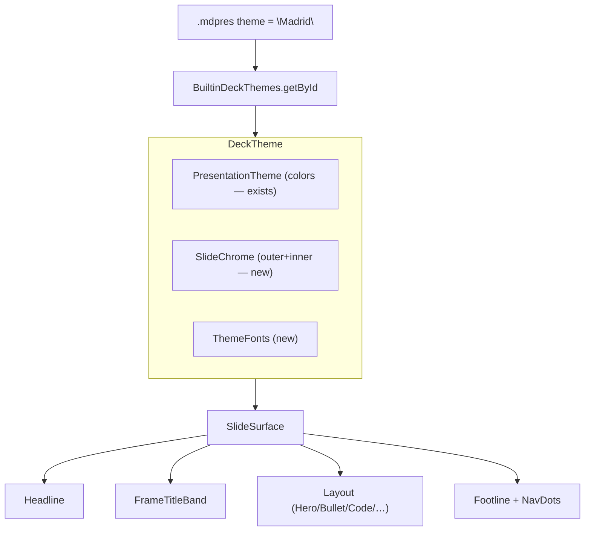

# Beamer-Like Themes for Skaldoria — Design Proposal

**Status:** DRAFT / PENDING REVIEW (author was away; brainstorming hard-gate means no code was written yet)
**Date:** 2026-08-04 **Topic:** Adding LaTeX Beamer-style theming to Skaldoria Presentation Studio

---

## 1. Motivation

The idea raised: *"can we add themes like LaTeX Beamer (Warsaw, Madrid, ...)?"*

### What Skaldoria has today

A **theme** is a flat **color-token palette** only:

- `PresentationTheme` (`src/desktopMain/kotlin/com/skaldoria/theme/PresentationTheme.kt`) — ~25 `Color` tokens
  (background, surface, primary, accent, text*, code*, badge*).
- 4 built-ins in `BuiltinThemes.kt` (Nord Dark, Sleek Light, Cyber Midnight, Minimalist Editorial).
- The deck picks one by name: `DeckProject.themeName` (`core/models/DeckProject.kt`) and the `.mdpres` manifest
  `"theme"` field.

### What "Beamer-like" actually means

Beamer deliberately splits a theme into **four composable parts**:

| Beamer concept                      | Controls                                                | Skaldoria today                                     |
|:------------------------------------|:--------------------------------------------------------|:----------------------------------------------------|
| **color theme** (beaver, dolphin…)  | palette                                                 | ✅ = `PresentationTheme`                            |
| **outer theme** (Madrid, Berlin…)   | headline/footline bars, sidebar, frame decorations, nav | ❌ chrome is hardcoded                              |
| **inner theme** (rounded, circles…) | block frames, list bullets, title-page layout           | ❌ hardcoded per layout                             |
| **font theme**                      | serif/sans, sizes                                       | ❌ hardcoded `FontFamily.SansSerif` in every layout |

So the gap is **structure/chrome + fonts**, not colors. The famous named themes (Warsaw, Madrid, Singapore) are really
*outer+inner+color presets*.

### Where chrome is hardcoded today (the real work)

- `SlideSurface.kt` — the footer bar (layout-type pill + `n / total`) is baked in with fixed padding/font. This is the
  analogue of Beamer's **footline**. There is **no headline** and **no frame-title band**.
- Each layout in `ui/layouts/*.kt` hardcodes `FontFamily.SansSerif`, corner radii, and spacing (e.g. `HeroTitleSlide` =
  the title page / `inner theme`).

---

## 2. Proposed Approaches

### Approach A — "Named color palettes only" (smallest)

Just add more `PresentationTheme` entries named after Beamer themes (a "Warsaw" palette, etc.).

- 👍 Trivial: a few `BuiltinThemes` entries, zero architecture change.
- 👎 Misleading — users expecting Beamer's *chrome* (title bands, footlines, nav dots) get only recolored slides. Doesn't
  deliver the actual ask.

### Approach B — Add a separable `SlideChrome` layer (recommended)

Keep `PresentationTheme` as the **color theme** (unchanged). Introduce a new **structural** layer describing chrome, and
compose them:

```
DeckTheme = colorTheme: PresentationTheme   (exists)
          + chrome:     SlideChrome          (new: outer+inner)
          + fonts:      ThemeFonts           (new)
```

- 👍 Mirrors Beamer's real model; each piece is independently swappable and testable.
- 👍 Backward compatible — existing decks keep working with a default chrome.
- 👎 More surface area: `SlideSurface` and layouts must read chrome/font tokens instead of hardcoding.

### Approach C — Full four-way composability exposed in the manifest

Approach B **plus** letting the manifest pick color/outer/inner/font independently
(`"colorTheme": "nord", "outerTheme": "madrid", "fontTheme": "serif"`), exactly like Beamer's `\usecolortheme` /
`\useoutertheme`.

- 👍 Maximum flexibility and the most faithful to Beamer.
- 👎 Likely YAGNI for now: more manifest complexity and a bigger picker UI than most users need on day one.

---

## 3. Recommendation

**Approach B**, shipped incrementally, with **named presets** (Warsaw/Madrid/Singapore-style bundles) layered on top so
users still get a one-word choice. Approach C stays a future option because B's data model is forward-compatible with it
(a preset is just a fixed `(color, chrome, fonts)` triple; exposing the parts separately later is additive).

Rationale: it delivers the *actual* Beamer feel (title bands, headline/footline, nav) that Approach A cannot, without
the manifest/UI overhead of C. It also cleans up a real code smell — chrome and fonts currently duplicated/hardcoded
across `SlideSurface` and every layout.

---

## 4. Design Sketch (Approach B)

### 4.1 New model types (`theme/` package)

```kotlin
// Outer + inner structural tokens. Colors still come from PresentationTheme.
data class SlideChrome(
  val id: String,
  val name: String,
  // Frame title band (Beamer frametitle) — the biggest visible difference
  val frameTitle: FrameTitleStyle,      // NONE | PLAIN | BAND | SIDEBAR_TAB
  // Headline bar (top) and footline bar (bottom)
  val headline: BarStyle,               // NONE | MINIMAL | SECTION_NAV | DOTS
  val footline: BarStyle,               // NONE | PAGE_NUMBER | AUTHOR_TITLE_PAGE
  val showNavDots: Boolean,             // Beamer navigation circles
  // Inner theme
  val blockShape: BlockShape,           // SQUARE | ROUNDED | SHADOWED
  val bulletGlyph: BulletGlyph,         // DASH | DOT | TRIANGLE | SQUARE
  val cornerRadiusDp: Int
)

data class ThemeFonts(
  val id: String,
  val titleFamily: FontFamily,          // e.g. Serif for a "professional" theme
  val bodyFamily: FontFamily,
  val monoFamily: FontFamily,
  val titleWeight: FontWeight
)

// The composite a deck actually renders with.
data class DeckTheme(
  val id: String,
  val name: String,                     // preset name, e.g. "Madrid"
  val colors: PresentationTheme,
  val chrome: SlideChrome,
  val fonts: ThemeFonts
)
```

### 4.2 Presets (Beamer-flavored bundles)

`BuiltinDeckThemes` composes existing palettes with new chrome/fonts:

| Preset                  | colors              | chrome (frameTitle / bars / nav)                | fonts                                          |
|:------------------------|:--------------------|:------------------------------------------------|:-----------------------------------------------|
| **Madrid**              | SleekLight          | BAND title, footline=AUTHOR_TITLE_PAGE, navDots | serif titles                                   |
| **Warsaw**              | NordDark            | BAND title, headline=SECTION_NAV + footline     | sans                                           |
| **Singapore**           | CyberMidnight       | headline=DOTS, no footline                      | sans                                           |
| **Berkeley**            | MinimalistEditorial | SIDEBAR_TAB frame title                         | serif                                          |
| **Default (Skaldoria)** | current behavior    | current footer only                             | sans — *keeps today's look for existing decks* |

### 4.3 Rendering changes

- `SlideSurface(slide, theme, …)` → `SlideSurface(slide, deckTheme, …)`; the hardcoded footer becomes
  `Footline(deckTheme.chrome.footline, deckTheme.colors)`, and a new optional `Headline(...)` + `FrameTitleBand(...)`
  are added.
- Layouts read `deckTheme.fonts.*` / `deckTheme.chrome.bulletGlyph` instead of `FontFamily.SansSerif` and literal
  bullets. Colors keep coming from `deckTheme.colors` (rename param, same tokens) — minimal churn.
- New small composables: `FrameTitleBand`, `Headline`, `Footline`, `NavDots`, all in `ui/components/chrome/`, each
  independently previewable/testable.

### 4.4 Persistence / manifest (backward compatible)

- `DeckProject.themeName` keeps meaning "preset name"; `BuiltinDeckThemes.getById()` resolves it, defaulting to
  **Default (Skaldoria)** so old decks are visually unchanged.
- No manifest schema break. (Approach C's split fields would be *added* later, not required.)

### 4.5 Component boundaries (isolation check)

| Unit                                   | Does              | Depends on                                |
|:---------------------------------------|:------------------|:------------------------------------------|
| `SlideChrome`/`ThemeFonts`/`DeckTheme` | pure data         | Compose `Color`/`FontFamily` only         |
| `BuiltinDeckThemes`                    | preset registry   | the data types + existing `BuiltinThemes` |
| `chrome/*` composables                 | draw one bar/band | a `DeckTheme`                             |
| layouts                                | slide body        | `DeckTheme` (colors+fonts)                |

Each is understandable and testable in isolation; presets are data, so adding "Warsaw" never touches rendering code.

---

## 5. Diagram



---

## 6. Scope / YAGNI

**In:** structural chrome layer, font layer, ~4–5 Beamer-flavored presets, backward-compatible default, targeted
refactor of `SlideSurface` + layouts to read tokens.

**Out (for now):** manifest-level independent color/outer/inner/font selection (Approach C), a live theme-builder UI,
user-authored custom chrome files, animated transitions between chromes.

---

## 7. Open Questions (for reviewer)

1. Which target: **A**, **B (recommended)**, or **C**?
2. How faithful should presets look vs. Beamer originals — homage names, or pixel-accurate recreations?
3. Should the **Default** preset stay byte-for-byte identical to today's footer (recommended, for zero regression)?
4. Fonts: OK to rely on bundled `FontFamily`s, or do you want to ship actual TTFs (e.g. a serif) with the app?

---

*Next step once a direction is picked: run the `writing-plans` skill to turn the chosen approach into a step-by-step
implementation plan. No source files under `src/` have been modified yet.*
