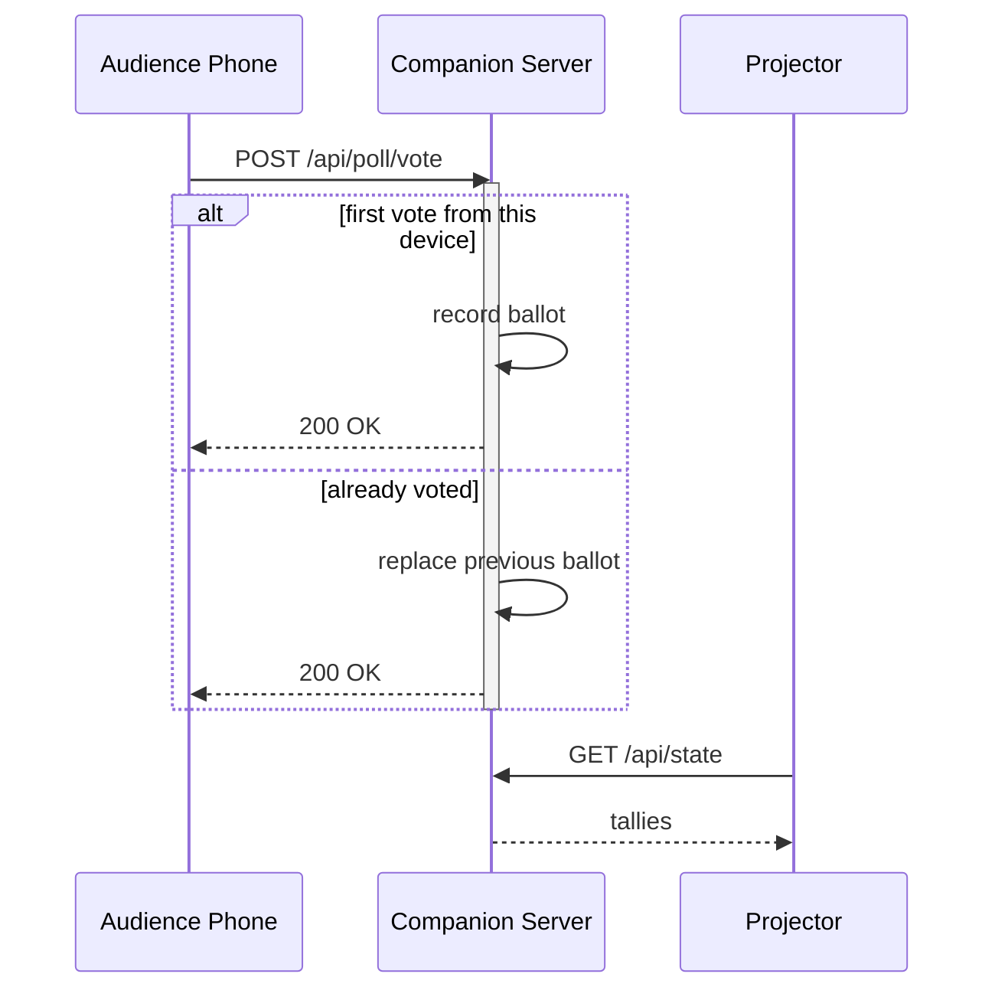

## Voting Round Trip
### Mermaid sequence diagram

<!-- note: One ballot per device. Voting again replaces your choice instead of stacking, which is why totals never inflate when someone refreshes. -->
