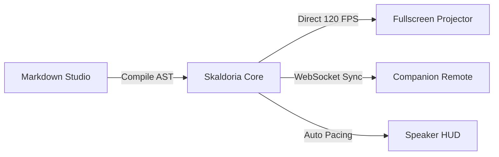

## Distributed Pipeline Architecture
### Real-Time Presentation Sync Engine

```mermaid
flowchart LR
    Editor[Markdown Studio] -->|Compile AST| Engine[Skaldoria Core]
    Engine -->|Direct 120 FPS| Deck[Fullscreen Projector]
    Engine -->|WebSocket Sync| Mobile[Companion Remote]
    Engine -->|Auto Pacing| Presenter[Speaker HUD]
```

<!-- note: Point out how the decoupled modular architecture enables seamless multi-monitor and mobile sync. -->
